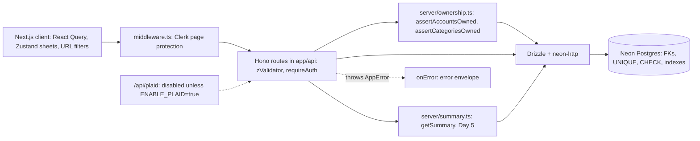

# Finance SaaS V2: Simplified Completion Plan

**Goal:** a polished, deployed, full-stack personal finance app I can defend line by line in an internship interview. I should finish it quickly and then put my time back into LeetCode and applications.

**Rule for the remaining work:** no new technologies, no new abstraction layers, no schema redesign. Code changes only where they fix a real bug, close a security gap, support the one performance story, or make the deployed app safe to show.

**Decisions locked in:**
- Plaid sync is future work. The deployed app disables Plaid server-side and hides it in the UI.
- The LemonSqueezy paywall is turned off for the portfolio build. CSV import and every chart type are free for all users. The Subscription row is hidden. The LemonSqueezy code stays as untouched tutorial baseline.
- Scope cleanup (done before Day 3): migration `drizzle/0005_v2_scope_cleanup.sql` dropped the `budgets` table and `accounts.currency_code`. Neither was used by any UI, API, validation, or business logic, and the app is USD-only.
- `bank_connections`, the `plaid_*` columns, and `subscriptions` stay. The tutorial's Plaid and LemonSqueezy code still references them. There are no further removal migrations.

---

## 1. Final project scope

The project is complete once these work in the deployed app:

- **Authentication:** Clerk sign-up and sign-in. Every dashboard page requires a session.
- **Accounts:** create, edit, delete, bulk delete, list.
- **Categories:** create, edit, delete, bulk delete, list.
- **Transactions:** create, edit, delete, bulk delete, list. Filtering by date range and account comes from the existing URL filters. Text search comes from the existing `DataTable` payee filter (client-side).
- **CSV import:** strict money and date parsing (already done), line-numbered errors, all-or-nothing import, tenant-safe account and category IDs, and a row cap.
- **Dashboard:** income, expenses, net (remaining), percent change against the previous period, category breakdown (including "Uncategorized"), and a daily chart for the selected date range.
- **Engineering quality:** PostgreSQL with Drizzle, Zod validation at the API boundary, tenant-safe reads and writes, a consistent error envelope that the UI displays, focused unit and DB integration tests, one measured query optimization, a deployed URL, and a strong README.

---

## 2. Completed Day 1-2 work that stays (do not touch except to extend)

- **V2 schema** in [db/schema.ts](db/schema.ts): `accounts`, `categories`, `transactions`, `subscriptions`, plus `bank_connections`, which is kept for the dormant Plaid code. `budgets` and `currency_code` were removed by `0005_v2_scope_cleanup`. Derived ownership (transactions are owned through `accounts.user_id`). FKs with `CASCADE` and `SET NULL`. Unique constraints. `accounts(user_id)` index.
- **Migrations:** `drizzle/0003_v2_reset.sql`, the hand-written CHECKs in `drizzle/0004_v2_constraints.sql`, and the `0005_v2_scope_cleanup.sql` drop of `budgets` and `currency_code`. All three are applied to dev, test, and bench. [scripts/migrate.ts](scripts/migrate.ts) is a TCP `pg` migrator that runs in one transaction, rejects `-pooler` hosts, and refuses overlapping targets (`db:migrate`, `db:migrate:test`, `db:migrate:bench`).
- **Neon dev, test, and bench branches** with separate connection strings, guarded so they can't point at the same database.
- **Safe seed:** requires `SEED_USER_ID` and deletes only that user's manual rows, in one `db.batch()`. Destructive test helpers refuse to run unless `DATABASE_URL === DATABASE_URL_TEST`.
- **Vitest:** unit tests (`bun run test`) and serial DB integration tests against the Neon test branch (`bun run test:db`).
- **HTTP foundation:** [server/http/errors.ts](server/http/errors.ts) (`AppError`, an `onError` that returns `{ error: { code, message } }` and never echoes unexpected errors, `onNotFound`) and [server/http/auth.ts](server/http/auth.ts) (`requireAuth`, which fails closed).
- **Money:** `amount_cents INTEGER`, positive means inflow, and the string-based `parseMoneyToCents` in [lib/money.ts](lib/money.ts) with no floats. The DTO caps amounts at ±$10M.
- **Dates:** `transaction_date DATE` in Drizzle string mode, with `"YYYY-MM-DD"` on the wire. [lib/dates.ts](lib/dates.ts) provides `toDateOnly`, `parseDateOnly`, UTC epoch-day arithmetic, and `previousPeriod`.
- **DTOs:** [lib/schemas/transaction.ts](lib/schemas/transaction.ts) (create, update, import row, bulk, range query, response). Transaction forms no longer import `@/db/schema`.
- **CSV:** [lib/csv-import.ts](lib/csv-import.ts) accepts a whitelist of date formats, uses the shared money parser, validates each row against the DTO, reports errors as "Line N", and imports all-or-nothing.
- **Tests:** unit tests for money, dates, CSV, transaction schemas, the error envelope, `requireAuth`, database targets, and the seed guards. The DB contract test locks in the DATE string round trip under `TZ=Pacific/Kiritimati`.

---

## 3. Features explicitly removed or postponed

Postponed to "Future work" in the README (no implementation time):
- Plaid: incremental `/transactions/sync` with a cursor, `added`/`modified`/`removed` handling, webhooks and verification, sync leases and concurrency, background sync, sign-flip adapter, `itemRemove` on disconnect, encrypting the access token at rest.
- Budgets: the API, UI, and utilization analytics. The `budgets` table was part of the earlier V2 design and was dropped in `0005_v2_scope_cleanup`.
- The `/insights` page and the four analytics endpoints (cash flow, category trends, budget utilization, recurring detection).
- Recurring-payment detection, merchant normalization, notifications, multi-currency and FX (the app is USD-only; `currency_code` was dropped in `0005`), and the AI assistant.
- Server-side pagination of transactions.

Removed from the remaining roadmap entirely:
- LemonSqueezy work: `isEntitled`, `requireSubscription`, webhook hardening. The paywall is turned off instead.
- The A/B1/B2/C/D benchmark matrix, covering-index experiments, materialized views, Redis, and benchmarking the analytics queries.
- The per-domain service layer (`server/services/{transactions,accounts,...}.ts`). Routes stay where they are.
- Chunked bulk insert inside `db.batch()`, replaced by a row cap with a single INSERT (section 10).
- The "about 24 tests" target. Test count is no longer a goal.
- `docs/decisions.md`. Decisions go in the README and LEARNING.md.

---

## 4. Revised architecture



- **One request:** hook, then Hono RPC client, then `clerkMiddleware()`, `requireAuth`, and `zValidator`. The handler calls an ownership helper on writes, runs Drizzle queries scoped by `accounts.user_id`, and returns `c.json({ data })`. Any thrown `AppError` becomes `{ error: { code, message } }`, which the mutation hooks surface as a toast.
- **Only two new server files:** [server/ownership.ts](server/ownership.ts) (Day 3) and [server/summary.ts](server/summary.ts) (Day 5, which moves the existing summary queries out of the route so the benchmark and test can call them). Both are plain functions with `import "server-only"`. There's no repository or service layer.
- **Database guarantees vs. application guarantees:**
  - The database guarantees no orphans (FKs), cascades, valid name and payee lengths and a consistent Plaid link (CHECKs), and provider-ID uniqueness. The DTO enforces the amount cap.
  - The application guarantees that a transaction's account and category belong to the caller. Ownership is derived, so the database can't express that without denormalizing (the D2 decision is kept).
- **Unchanged:** neon-http driver, Drizzle 0.30, drizzle-kit 0.21, Hono RPC chained routes, cuid2 IDs, Clerk, the existing UI.

---

## 5. Revised Day 3-6 implementation plan

### Day 3: Tenant authorization

New [server/ownership.ts](server/ownership.ts). Each helper is one set-based query, so a bulk import costs two ownership queries no matter how many rows it has:

```ts
export async function assertAccountsOwned(userId: string, ids: string[]) {
  const unique = [...new Set(ids)];
  if (unique.length === 0) return;
  const rows = await db.select({ id: accounts.id }).from(accounts)
    .where(and(eq(accounts.userId, userId), inArray(accounts.id, unique)));
  if (rows.length !== unique.length) {
    throw new AppError("UNPROCESSABLE", 422, "Invalid accountId");
  }
}
// assertCategoriesOwned: same query on categories; null / undefined ids are skipped.
```

Changes to [app/api/[[...route]]/transactions.ts](app/api/[[...route]]/transactions.ts):
- `POST /`: check the account, then the category if one is set, then insert.
- `POST /bulk-create`: check the distinct account IDs and category IDs once each, then run the existing single multi-row INSERT. One statement is already atomic. Add `.min(1).max(5000)` to `bulkCreateTransactionsSchema` in [lib/schemas/transaction.ts](lib/schemas/transaction.ts), which keeps the INSERT under Postgres's 65,535 bind-parameter limit.
- `PATCH /:id`: check the new `accountId` and `categoryId`, then run the existing CTE update scoped by ownership. A row the caller doesn't own still returns 404. Set `updatedAt` on update.
- `GET /` and `GET /:id`: add `eq(categories.userId, userId)` to the `leftJoin(categories)` condition, so a foreign category name can never be displayed.
- Do the same tenant filter on the category `innerJoin` in [app/api/[[...route]]/summary.ts](app/api/[[...route]]/summary.ts).
- Reads and deletes otherwise stay as they are; they're already scoped by `accounts.user_id`.

Status code rule:
- An ID in the path that the caller doesn't own returns 404. This is the same response as "not found", so existence isn't leaked.
- An ID in the request body that the caller doesn't own returns 422. The message is the same whether the ID doesn't exist or belongs to someone else.

Consistency changes in the four core routers (transactions, accounts, categories, summary). I'm editing these files anyway:
- Replace `clerkMiddleware()` plus the inline `if (!auth?.userId)` checks with a chained `.use(clerkMiddleware()).use(requireAuth)`. Keep the routes chained so Hono RPC types still work, and read the user with `c.get("userId")`.
- Replace inline `c.json({ error: "..." }, 4xx)` with `throw new AppError(...)`.
- Change `:id` params from `z.string().optional()` to `z.string().min(1)`.
- Don't touch the `plaid` or `subscriptions` routers beyond the Day 4 Plaid guard.

Account and category DTO cleanup. This is worth doing because it removes the last client imports of `@/db/schema` and stops `.returning()` from returning every column:
- Add [lib/schemas/account.ts](lib/schemas/account.ts) and [lib/schemas/category.ts](lib/schemas/category.ts) with `{ name: z.string().trim().min(1).max(100) }`, matching the CHECK.
- Change the forms and sheets in `features/accounts/components/*` and `features/categories/components/*` to import those schemas.
- In the routes, change `select()` and `.returning()` to explicit `{ id, name }`.
- Remove `insertAccountSchema` and `insertCategorySchema` from [db/schema.ts](db/schema.ts).

Tests: new `tests/db/authorization.test.ts`. It calls `app.request()` with `@hono/clerk-auth` mocked through `vi.mock`, using two seeded users A and B. See section 6.

Before finishing: `bun run typecheck`, `bun run test`, `bun run test:db`. Then append a short "Day 3" section to LEARNING.md.

### Day 4: Application quality and completion (no new features)

- **Mutation errors:**
  - Add a tiny helper, `lib/api-error.ts`, that reads `{ error: { message } }` and falls back to "Something went wrong".
  - Every mutation hook in `features/{accounts,categories,transactions}/api/` does `if (!response.ok) throw new Error(await readErrorMessage(response))`.
  - `onError` toasts that message.
  - A 400, 404, or 422 no longer shows a success toast or closes the sheet.
- **Paywall off:**
  - Remove the `usePaywall` gating from [app/(dashboard)/transactions/upload-button.tsx](app/(dashboard)/transactions/upload-button.tsx), [components/chart.tsx](components/chart.tsx), and [components/spending-pie.tsx](components/spending-pie.tsx).
  - Leave `features/subscriptions/*` and the `subscriptions` router in place, unused by the UI.
- **Plaid disabled:**
  - Add a first `.use()` on the `plaid` router in [app/api/[[...route]]/plaid.ts](app/api/[[...route]]/plaid.ts) that throws a 404 `AppError` unless `process.env.ENABLE_PLAID === "true"`.
  - Change `GET /connected-bank` to select only `{ id, institutionName, lastSyncedAt }`. This closes the `access_token` leak even if someone turns Plaid back on.
  - Reduce [app/(dashboard)/settings/settings-card.tsx](app/(dashboard)/settings/settings-card.tsx) to a static card with no Plaid or subscription hooks and no Connect button. It says bank sync is planned future work.
- **Page protection:**
  - In [middleware.ts](middleware.ts), protect `/`, `/transactions(.*)`, `/accounts(.*)`, `/categories(.*)`, and `/settings(.*)`.
  - Restore Clerk's documented matcher with the escaped regex (`"/((?!.+\\.[\\w]+$|_next).*)"`).
- **Category breakdown correctness:**
  - In the summary category query, change the join to `leftJoin(categories, ... AND categories.user_id = userId)` and group by `COALESCE(categories.name, 'Uncategorized')`. Uncategorized expenses then appear in the pie.
  - This lands before Day 5 so the benchmark measures the final, correct query.
- **Small cleanups:** remove `console.log({ results })` from [app/(dashboard)/transactions/page.tsx](app/(dashboard)/transactions/page.tsx) and replace the "Create Next App" metadata in [app/layout.tsx](app/layout.tsx).
- **Browser smoke test** (local dev against the Neon dev branch):
  - sign up
  - create an account and a category
  - create, edit, and delete a transaction
  - try a foreign-ID edit with curl and confirm it's rejected
  - date filter and account filter
  - CSV import with a good file and with a file containing one bad line (check the line-numbered error)
  - check dashboard totals against the transactions table
  - try to save an invalid form and confirm an error toast appears
  - confirm a signed-out visit to `/transactions` redirects to sign-in
- Append a short "Day 4" section to LEARNING.md.

### Day 5: One small performance optimization

Order of steps:
1. **Lock correctness first.** Add `tests/db/summary.test.ts` with a small hand-computed fixture (section 6). It must pass before and after every change.
2. **Extract** the existing summary queries, unchanged, into `getSummary(userId, { from, to, accountId })` in [server/summary.ts](server/summary.ts). The route calls it. Same queries, same response shape.
3. **Seed the bench branch:**
   - `scripts/bench/seed.ts` runs against `DATABASE_URL_BENCH`, after `bun run db:migrate:bench`.
   - It generates data with server-side `INSERT ... SELECT generate_series(...)` and `setseed()`, so the dataset is deterministic.
   - About 1M transactions in total: one target "heavy" user with about 3 accounts and about 150k transactions over 3 years, plus background users so the table is realistically large.
   - About 5% uncategorized. Run `ANALYZE` at the end.
4. **Baseline:**
   - `scripts/bench/run-summary.ts` runs `EXPLAIN (ANALYZE, BUFFERS)` through `pg` on each summary query for the heavy user, with 30-day and 365-day ranges. It records Postgres `Execution Time` (median of about 10 warm runs).
   - It also records `getSummary` wall-clock time: 5 warm-ups, then p50 and p95 over 20 runs.
   - It records the environment: Neon region, compute size, Postgres version, client location.
5. **Identify one real bottleneck** in the plans.
   - The expected candidate: scans driven by `accounts.user_id` read every one of the user's transactions and then filter by date.
   - The second candidate: wall-clock time dominated by four sequential neon-http round trips.
6. **Apply one change at a time, then re-measure after each:**
   - Index (only if the plan supports it): declare `index("transactions_account_id_transaction_date_idx").on(table.accountId, table.transactionDate)` in [db/schema.ts](db/schema.ts). drizzle-kit 0.21 can generate plain indexes, which gives `drizzle/0006_*.sql`. Apply it to bench, then dev and test.
   - Round trips (only if wall-clock time is mostly network): run the four independent queries together with `db.batch([...])` (one HTTP round trip) or `Promise.all`. That's a small change inside `getSummary`.
   - If a change doesn't help, don't keep it, and write down that it was measured and rejected. That's still an honest result.
7. **Record:** `docs/benchmarks.md` covers the dataset, environment, method, before and after numbers, and the plan excerpts that justify the change. Raw plans go in `docs/bench/`. No number is written down before it's measured.
8. Append a short "Day 5" section to LEARNING.md.

### Day 6: Portfolio finish

- **Production deploy:**
  - Create a Neon production branch (or use `main`) and run `db:migrate` against its direct URL.
  - Deploy to Vercel with Clerk keys and `DATABASE_URL`. Leave `ENABLE_PLAID` unset.
  - Confirm the build and runtime work without the Plaid and LemonSqueezy environment variables. If a module reads them at import time, guard that read.
- **Full browser QA** on the deployed URL, repeating the Day 4 checklist.
- **README** in [README.md](README.md):
  - one-paragraph pitch, live demo link, screenshots
  - feature list
  - tech stack
  - mermaid architecture diagram (from section 4)
  - setup: environment variables, Neon dev/test/bench, `db:migrate*`, `db:seed`, `test`, `test:db`
  - a short summary of each of the four engineering stories
  - benchmark result with a link to `docs/benchmarks.md`
  - limitations and future work (Plaid sync, budgets, pagination, multi-currency)
  - **an honest "Tutorial baseline vs. my V2 work" section:**
    - Baseline: UI, CRUD screens, charts, the Plaid Link and LemonSqueezy flows.
    - Mine: schema redesign, cents and DATE model, DTOs, CSV parsing, tenant authorization, error handling, tests, environments and migrations, performance work.
- **Sample CSV** at `docs/sample-transactions.csv` so reviewers can try the import.
- **LEARNING.md:**
  - Add a one-line note at the top saying sections 1-17 describe the V1 baseline.
  - Add a final "Interview cheat sheet" section covering the four stories (section 9 of this plan).
  - Don't rewrite the baseline sections.
- **Resume bullets** finalized with the measured numbers from `docs/benchmarks.md`.
- If everything is resume-ready before Day 6, stop early.

---

## 6. Final testing scope

Existing tests stay as they are. Add tests only for new high-risk behavior.

Day 3 authorization (`tests/db/authorization.test.ts`, through `app.request()` with mocked Clerk):
1. `POST /transactions` into user B's account returns 422 and inserts 0 rows.
2. `POST /transactions` with user B's category returns 422.
3. `PATCH` on your own transaction to move it into B's account returns 422, and the row is unchanged.
4. `PATCH` on your own transaction to attach B's category returns 422.
5. `POST /bulk-create` with one foreign account ID among valid rows returns 422 and inserts 0 rows.
6. `GET`, `PATCH`, and `DELETE` on B's transaction return 404 (one test, three assertions).
7. An unauthenticated request returns 401 with the error envelope.

Day 5 summary correctness (`tests/db/summary.test.ts`, calling `getSummary` directly):
- Hand-computed totals for income, expenses, and net.
- A zero amount is counted as neither income nor expense.
- Two transactions on the same day produce one chart point.
- A transaction on the `to` date is included.
- Uncategorized expenses appear as "Uncategorized".
- Another user's rows and categories never appear.

That's the whole remaining test scope: about 8 to 9 new tests. There are no Plaid, budget, or analytics tests, and there's no coverage target.

---

## 7. Final benchmark scope

- **Target:** the dashboard summary (`getSummary`), meaning its period-totals, category, and daily-series queries over a date range.
- **Dataset:** about 1M synthetic transactions on the Neon `bench` branch, generated deterministically, with one heavy user (about 150k transactions) as the measured tenant.
- **Measurements:**
  - Postgres execution time from `EXPLAIN (ANALYZE, BUFFERS)`. This is the primary number because it's free of network noise.
  - `getSummary` end-to-end p50 and p95 from the bench script, as a secondary number.
  - Both for 30-day and 365-day ranges.
- **Changes allowed:**
  - At most the composite index `transactions(account_id, transaction_date)` and/or batching the summary queries into one round trip.
  - Each is applied only if the plans or timings justify it, and measured separately.
- **Out of scope:** covering indexes, `INCLUDE`, BRIN, materialized views, Redis, a `generate_series` rewrite (unless it's the measured bottleneck), analytics-query benchmarks, and multi-variant matrices.
- **Deliverable:** `docs/benchmarks.md` plus raw plans, and one resume line in the form "over N synthetic transactions, reduced X from A to B", using only measured values.

---

## 8. Definition of "resume-ready / project complete"

All of these are true:
- [ ] The deployed Vercel URL works for a brand-new Clerk user, and the full core workflow passes browser QA.
- [ ] Cross-user transaction writes are rejected (422), foreign path IDs return 404, and the authorization tests pass.
- [ ] Failed mutations show the server's error message, and no failure shows a success toast.
- [ ] Plaid can't be reached in the UI or through the API (404). There's no paywall, and the Settings page doesn't call broken endpoints.
- [ ] All dashboard pages require sign-in.
- [ ] `bun run typecheck`, `bun run test`, and `bun run test:db` all pass.
- [ ] `docs/benchmarks.md` has real before and after numbers (or an honest "measured, not adopted" result) with plan evidence.
- [ ] The README has the demo link, screenshots, architecture diagram, setup steps, the baseline vs. V2 section, the benchmark summary, and future work.
- [ ] LEARNING.md has the interview cheat sheet, and the resume bullets use only measured numbers.

Once these are checked, the project is done. Further work is optional.

---

## 9. The four interview stories to master

**A. Financial data modeling (integer cents)**
- Why floats are wrong: `0.1 + 0.2 !== 0.3`, and `1.15 * 100 = 114.99999999999999`.
- Why `INTEGER` cents beats miliunits (which cap at about $2.1M per row), `BIGINT` (which comes back as a string), and `NUMERIC` (also a string, and it tempts float conversion in JS).
- Per-row max is $21,474,836.47. `SUM(integer)` is `bigint`, so totals can't overflow.
- How `parseMoneyToCents` works with no floats: a regex splits sign, digits, and fraction, then integer math. Why `12,34` and `1.005` are rejected.
- One input boundary and one display boundary. Everything in between passes cents through unchanged.

**B. Date modeling (business DATE, `"YYYY-MM-DD"`)**
- A business date is a calendar fact, not an instant. The three kinds of time are business date (`DATE`), UI date (a local-midnight `Date`), and system timestamp (`timestamptz`).
- The V1 bug: picker entries were stored at local midnight converted to UTC, while CSV rows were stored at UTC midnight.
- `new Date("2026-10-02")` is UTC midnight, so it shows Oct 1 in Los Angeles. `parseDateOnly` and `toDateOnly` use local components instead.
- Drizzle string mode, the neon-http driver returning the raw string, and the Kiritimati round-trip test.
- Inclusive `BETWEEN` filters on strings, with no end-of-day hacks. Range arithmetic uses UTC epoch days, so DST can't drop a day.

**C. Multi-tenant authorization**
- Authentication (Clerk verifies the JWT, and `requireAuth` fails closed) vs. authorization (does this user own this row).
- Derived ownership: a transaction belongs to whoever owns its account. That's normalized (no transitive `user_id`), and the cost is a join on reads and a check on writes.
- The IDOR: V1 inserted any `accountId` and `categoryId`, and PATCH could move a row into another user's account.
- The fix: `assertAccountsOwned` and `assertCategoriesOwned`, each one set-based query, used by create, update, and bulk-create.
- 404 for path IDs vs. 422 for body IDs, and why neither leaks existence.
- Why check-then-write is safe here: `user_id` is immutable and the FK rejects a deleted account.
- The alternatives: denormalized `user_id` with composite FKs, Postgres RLS, and `INSERT ... WHERE EXISTS`, and why each wasn't chosen.

**D. Database performance**
- The method: deterministic synthetic data, then a baseline, then `EXPLAIN (ANALYZE, BUFFERS)`, then one change, then re-measure.
- How to read a plan: sequential vs. index scan, rows removed by filter, buffers, execution time.
- Composite index column order: equality (`account_id`) first, range (`transaction_date`) second.
- neon-http latency math: each query is one HTTPS round trip, so four sequential queries vs. one `db.batch`.
- Why execution time and wall-clock time are reported separately, and what the measured result was.

Not required: Plaid sync internals, leases, webhook verification, queues, or other distributed infrastructure. Those are future work, and I should describe them that way.

---

## 10. Remaining complexity I recommend cutting (already applied above)

- **Chunked bulk insert in `db.batch()`:** replaced by a 5,000-row cap and the existing single INSERT. One statement is already all-or-nothing, and the cap keeps it under the bind-parameter limit.
- **Per-domain service files:** replaced by one ownership helper file and one extracted `getSummary`. Routes stay as thin as they are now.
- **Benchmark matrix:** at most two changes, each measured once. Execution time is the primary metric, so I don't need interleaved N=50 runs.
- **LemonSqueezy work:** cut; the paywall is off.
- **Plaid work:** cut, apart from a server guard and the safe `connected-bank` select.
- **`requireAuth` and `AppError` retrofit:** only in the four core routers. The `plaid` and `subscriptions` routers are left alone.
- **Error envelope for `zValidator` failures:** skipped. The client helper's fallback message covers it, and form-level Zod validation catches these errors first anyway.
- **`docs/decisions.md` and long LEARNING.md day write-ups:** replaced by short Day 3-5 notes and one interview cheat sheet. LEARNING.md is already about 1,400 lines, and interview prep should focus on the four stories.
- **Unused schema:** `budgets` and `currency_code` were dropped in `0005_v2_scope_cleanup`. `bank_connections` and the `plaid_*` columns stay because the dormant Plaid code references them, and they're documented as future work.
- **Server-side pagination, soft deletes, an audit log, rate limiting, observability:** listed as future work in the README only.

Known limitations to state in the README rather than fix:
- With no `from`/`to` in the URL, the default range uses the server's "today".
- CSV sign convention is positive = inflow.
- Transaction lists aren't paginated server-side.
- USD only.
