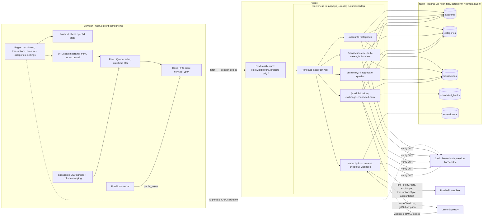
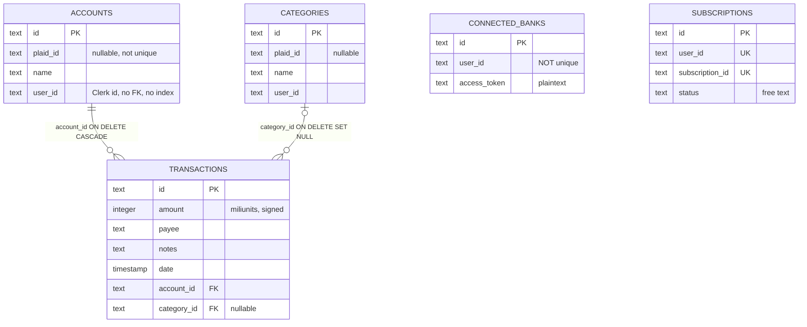
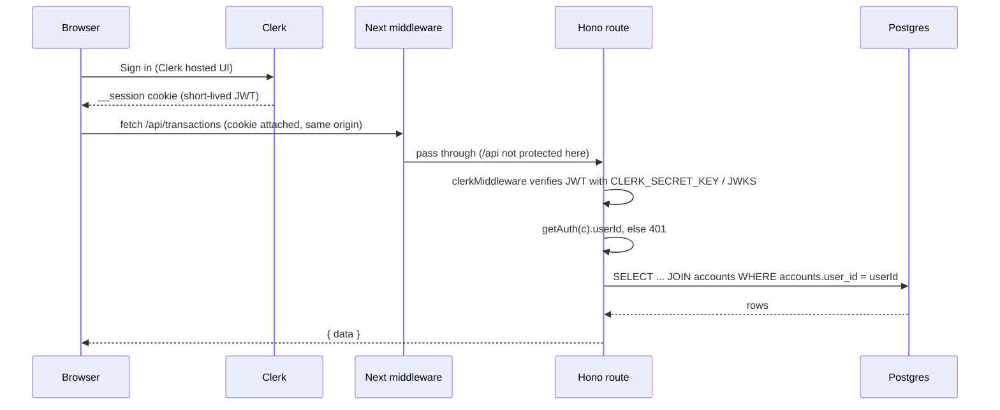
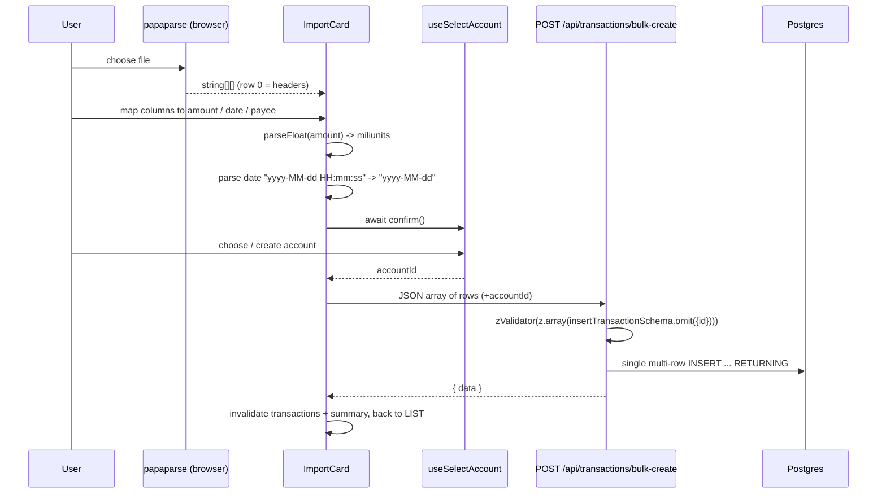
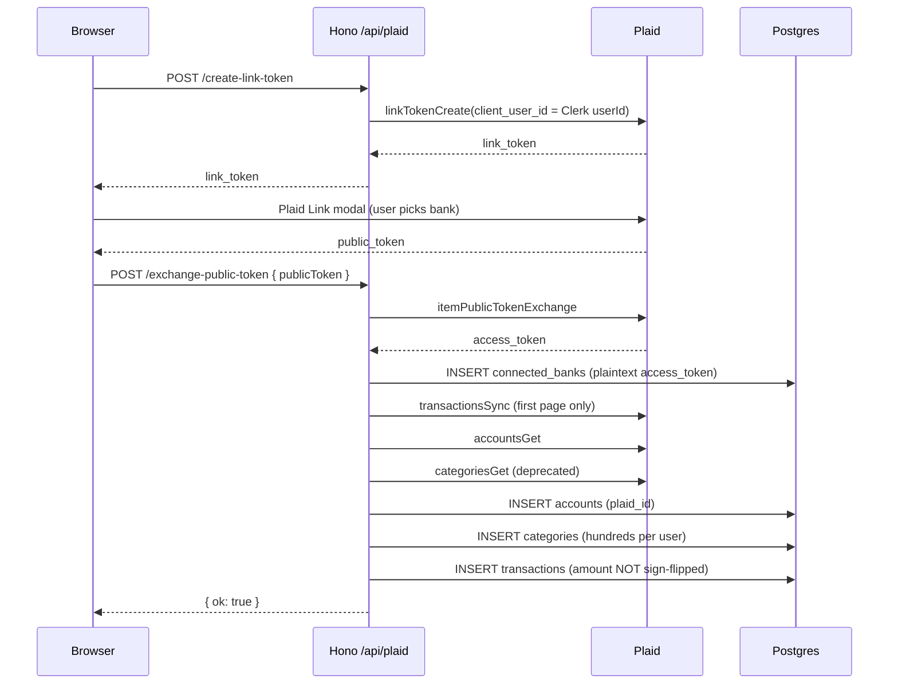
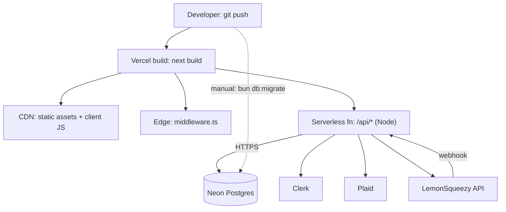

# LEARNING.md

My long-term technical reference and SWE interview prep for this project.

**Scope of this version:** sections 1–17 still describe the **original tutorial baseline**. Section 18 is the first V2 change set (Day 1: environments, tests, HTTP helpers, schema reset). Section 19 is Day 2 (money, dates, API contracts). Section 20 is the pre-Day 3 scope cleanup (budgets and multi-currency removed). Section 21 is the current final scope; where any earlier section mentions future work, §21 wins. Sections 22–24 are Days 3–5, §25 is the Day 6 release, and §26 is the **interview cheat sheet** (start there before an interview). Later days append new sections; they do not rewrite the baseline in place, so earlier mentions of `budgets` or `currency_code` describe the schema as it was at that point.

**Status legend used below**

- **What** – what the component does
- **Why** – why it exists / why it was probably designed this way
- **Files** – where it is implemented
- **Flow** – how data moves through it
- **Weaknesses** – problems in the current implementation
- **Interview** – what I must be able to explain out loud

---

## Table of Contents

1. [System Architecture](#1-system-architecture)
2. [Frontend Architecture](#2-frontend-architecture)
3. [Hono API Architecture](#3-hono-api-architecture)
4. [Database Schema and Relationships](#4-database-schema-and-relationships)
5. [Authentication vs Authorization](#5-authentication-vs-authorization)
6. [Account / Category / Transaction CRUD Flow](#6-account--category--transaction-crud-flow)
7. [CSV Import Flow](#7-csv-import-flow)
8. [Plaid Integration](#8-plaid-integration)
9. [Dashboard / Summary Queries](#9-dashboard--summary-queries)
10. [React Query / Zustand / URL State](#10-react-query--zustand--url-state)
11. [Validation and Error Handling](#11-validation-and-error-handling)
12. [Deployment Architecture](#12-deployment-architecture)
13. [Current Security Issues](#13-current-security-issues)
14. [Current Performance Issues](#14-current-performance-issues)
15. [Important Engineering Tradeoffs](#15-important-engineering-tradeoffs)
16. [Interview Questions I Should Be Able to Answer](#16-interview-questions-i-should-be-able-to-answer)
17. [Questions I Still Need to Answer Before V2](#17-questions-i-still-need-to-answer-before-v2)
18. [V2 Day 1 — Foundation, Schema Reset, and Safe Tooling](#18-v2-day-1--foundation-schema-reset-and-safe-tooling)
19. [V2 Day 2 — Money, Dates, and API Contracts](#19-v2-day-2--money-dates-and-api-contracts)
20. [Scope Cleanup — Budgets and Multi-Currency Removed](#20-scope-cleanup--budgets-and-multi-currency-removed)
21. [Current Final Scope](#21-current-final-scope)
22. [V2 Day 3 — Multi-Tenant Authorization](#22-v2-day-3--multi-tenant-authorization)
23. [V2 Day 4 — Reliability and Portfolio Cleanup](#23-v2-day-4--reliability-and-portfolio-cleanup)
24. [V2 Day 5 — PostgreSQL Performance Optimization](#24-v2-day-5--postgresql-performance-optimization)
25. [V2 Day 6 — Portfolio Release](#25-v2-day-6--portfolio-release)
26. [Interview Cheat Sheet](#26-interview-cheat-sheet)

---

## 1. System Architecture

### What

A single Next.js 14 (App Router) application that contains **both** the UI and the backend API. The API is a Hono app mounted inside one Next.js catch-all route handler. Data lives in Neon serverless PostgreSQL, accessed through Drizzle ORM. Authentication is outsourced to Clerk, bank data to Plaid (sandbox), and billing to LemonSqueezy.

### Why

- One repo, one deploy, one language (TypeScript) — ideal for a tutorial and for a solo developer.
- Hono's RPC client gives end-to-end type safety between server and client without code generation (a lightweight alternative to tRPC or OpenAPI codegen).
- Every external service is a managed SaaS, so there is no infrastructure to run.

### Files

| Area | Location |
|---|---|
| Pages / layouts | `app/`, `app/(auth)/`, `app/(dashboard)/` |
| API | `app/api/[[...route]]/*.ts` |
| Feature modules | `features/<domain>/{api,hooks,components}` |
| Shared UI | `components/`, `components/ui/` (shadcn/ui) |
| DB | `db/schema.ts`, `db/drizzle.ts`, `drizzle/` (migrations), `drizzle.config.ts` |
| Scripts | `scripts/seed.ts`, `scripts/migrate.ts` |
| Utilities | `lib/hono.ts`, `lib/utils.ts`, `lib/ls.ts` |
| Global providers | `providers/query-provider.tsx`, `providers/sheet-provider.tsx` |
| Edge middleware | `middleware.ts` |

The `features/` folder uses a **feature-sliced** layout:

- `features/x/api/` → React Query hooks that call the Hono client (`use-get-x`, `use-create-x`, …)
- `features/x/hooks/` → Zustand stores for UI state (`use-new-x`, `use-open-x`)
- `features/x/components/` → forms and sheets for that domain

### Flow (high level)



### Weaknesses

- **No layering.** Every route handler mixes HTTP parsing, auth, authorization, business rules and SQL. There is no service or repository layer to test in isolation.
- **Client imports the DB schema.** Forms import `insertTransactionSchema` / `insertAccountSchema` from `@/db/schema`, so the database shape *is* the API contract *is* the form contract. Changing a column ripples into the UI.
- **No tests, no CI, no logging, no env validation.** The README is still the default `create-next-app` README.
- **No background processing.** Anything slow (Plaid sync, big CSV imports) must finish inside one serverless request.

### Interview

- Describe it as a **modular monolith deployed as serverless functions**.
- Explain the benefits (simple deploys, shared types) and when you'd split it (long-running jobs, independent scaling, team boundaries).
- Explain what "end-to-end type safety" means here and what it does *not* give you (runtime validation of responses, versioning, non-TS clients).

---

## 2. Frontend Architecture

### What

A Next.js App Router frontend that, in practice, behaves like a **client-rendered SPA**: nearly every page and widget is a `"use client"` component that fetches data from `/api` after mount.

### Why

- Simple mental model: React Query + hooks everywhere.
- Clerk's client components (`<SignIn>`, `<UserButton>`) and interactive tables/charts are client-side anyway.

### Files

- Root: `app/layout.tsx` — wraps everything in `ClerkProvider` → `QueryProvider` → `SheetProvider` + `Toaster`.
- Route groups:
  - `app/(auth)/sign-in/[[...sign-in]]/page.tsx`, `app/(auth)/sign-up/[[...sign-up]]/page.tsx`
  - `app/(dashboard)/layout.tsx` — renders `Header` (logo, `Navigation`, `UserButton`, `WelcomeMsg`, `Filters`)
  - `app/(dashboard)/page.tsx` — overview (`DataGrid` + `DataCharts`)
  - `app/(dashboard)/transactions/` — table, columns, CSV import UI
  - `app/(dashboard)/accounts/`, `app/(dashboard)/categories/` — tables
  - `app/(dashboard)/settings/` — Plaid + subscription card
- Global sheets: `providers/sheet-provider.tsx` mounts `New/Edit{Account,Category,Transaction}Sheet` and `SubscriptionModal` once.
- Table: `components/data-table.tsx` (TanStack Table with client-side sort, filter, pagination, row selection, bulk delete).
- Charts: `components/chart.tsx`, `spending-pie.tsx`, `*-variant.tsx` (Recharts).
- Filters: `components/filters.tsx`, `account-filter.tsx`, `date-filter.tsx`.
- Promise-based dialogs: `hooks/use-confirm.tsx`, `features/accounts/hooks/use-select-account.tsx`.

### Flow (opening an edit sheet)

1. A table cell (e.g. `app/(dashboard)/transactions/actions.tsx`) calls `useOpenTransaction().onOpen(id)`.
2. The Zustand store flips `isOpen = true, id = <id>`.
3. `EditTransactionSheet` (always mounted by `SheetProvider`) re-renders, sees `isOpen`, runs `useGetTransaction(id)` (enabled only when `id` exists).
4. Form renders with `defaultValues` from the query.

### Key patterns

- **Global sheets + Zustand.** Any component anywhere can open any sheet without prop drilling. `SheetProvider` uses `useMountedState` so sheets only render on the client (avoids hydration mismatches).
- **Promise-returning dialogs.** `useConfirm()` returns `[Dialog, confirm]`. `confirm()` returns a `Promise` that resolves when the user clicks a button. This lets code write `const ok = await confirm()` — imperative flow on top of declarative React.
- **Inline creation.** `components/select.tsx` (react-select `CreatableSelect`) lets you create an account/category from inside the transaction form via `onCreate`.

### Weaknesses

- Server Components / server prefetching are not used; first paint always shows skeletons then fetches.
- Full datasets load into the browser; pagination/sorting/filtering are client-side only.
- `useSearchParams` used in client components without explicit `<Suspense>` boundaries.
- Page-level route protection only covers `/` (see §5).
- Metadata is still `"Create Next App"`.

### Interview

- Explain client vs server components and why this app is effectively client-only.
- Explain why global sheets + Zustand is a reasonable pattern for modals/drawers.
- Explain how `useConfirm` works internally (storing a `resolve` function in state).
- Explain client-side vs server-side pagination and when each breaks down.

---

## 3. Hono API Architecture

### What

One Hono app (`basePath("/api")`) composed from six sub-routers, exported through Next.js route handlers.

```13:28:app/api/[[...route]]/route.ts
const app = new Hono().basePath("/api");

const routes = app
  .route("/plaid", plaid)
  .route("/summary", summary)
  .route("/accounts", accounts)
  .route("/categories", categories)
  .route("/transactions", transactions)
  .route("/subscriptions", subscriptions)

export const GET = handle(app);
export const POST = handle(app);
export const PATCH = handle(app);
export const DELETE = handle(app);

export type AppType = typeof routes;
```

### Why

- `[[...route]]` is an **optional catch-all** segment, so every `/api/*` request lands in this one file and Hono does the real routing.
- `export const runtime = "nodejs"` — Plaid's SDK and Node's `crypto` (webhook HMAC) need Node, not the Edge runtime.
- Exporting `AppType` (type-only) lets the client build a fully typed RPC client.

### Files

- `app/api/[[...route]]/route.ts` — composition + Next handler export
- `app/api/[[...route]]/accounts.ts`, `categories.ts`, `transactions.ts`, `summary.ts`, `plaid.ts`, `subscriptions.ts`
- `lib/hono.ts` — `export const client = hc<AppType>(process.env.NEXT_PUBLIC_APP_URL!)`

### Endpoints

| Router | Endpoints |
|---|---|
| `/accounts` | `GET /`, `GET /:id`, `POST /`, `POST /bulk-delete`, `PATCH /:id`, `DELETE /:id` |
| `/categories` | same shape as accounts |
| `/transactions` | `GET /?from&to&accountId`, `GET /:id`, `POST /`, `POST /bulk-create`, `POST /bulk-delete`, `PATCH /:id`, `DELETE /:id` |
| `/summary` | `GET /?from&to&accountId` |
| `/plaid` | `GET /connected-bank`, `DELETE /connected-bank`, `POST /create-link-token`, `POST /exchange-public-token` |
| `/subscriptions` | `GET /current`, `POST /checkout`, `POST /webhook` |

### Flow (one request)

```
Browser hook → client.api.accounts.$post({ json })
  → fetch POST {APP_URL}/api/accounts  (Clerk __session cookie attached automatically)
  → Next middleware.ts (clerkMiddleware, does not block /api)
  → route.ts handle(app) → Hono router → accounts.ts .post("/")
     → clerkMiddleware()        // verifies JWT, attaches auth to context
     → zValidator("json", ...)  // 400 on failure
     → handler: getAuth(c) → check userId → db.insert(...).returning()
  → c.json({ data })
  → hook resolves, React Query invalidates caches
```

### Key concept: Hono RPC type inference

Routes are defined as one **chained expression** (`new Hono().get(...).post(...)...`). Each call returns a new Hono type that accumulates the route's path, method, validated input and `c.json(...)` output. `typeof routes` therefore encodes the whole API. `hc<AppType>` turns that into `client.api.transactions[":id"].$patch({ param, json })`, and `InferRequestType` / `InferResponseType` extract request/response types for hooks.

If routes were registered as separate statements (`app.get(...); app.post(...)`) the type would not accumulate and the client would lose its types.

### Weaknesses

- `clerkMiddleware()` repeated on every route instead of `app.use("*", clerkMiddleware())`.
- No `app.onError` / `app.notFound`: uncaught errors (Plaid failures, DB errors) become Hono's default plain-text 500.
- `:id` params validated as `z.string().optional()` then manually checked for undefined — redundant.
- `accounts.ts` and `categories.ts` are near-identical copy-paste.
- No rate limiting, request IDs, structured logging, or API versioning.
- Response shapes are inconsistent (`{ data }`, `{ ok: true }`, `{}`, `{ error }`).

### Interview

- Explain how a Next.js catch-all route hands off to a framework router.
- Explain Hono middleware ordering and context (`c.req.valid`, `getAuth(c)`).
- Explain why chaining matters for type inference.
- Explain Node vs Edge runtime and why this route needs Node.

---

## 4. Database Schema and Relationships

### What

Five tables in PostgreSQL, defined with Drizzle in `db/schema.ts`, migrated by `drizzle-kit`.

### Files

- `db/schema.ts` — tables, relations, `drizzle-zod` insert schemas
- `db/drizzle.ts` — `neon(DATABASE_URL)` + `drizzle(sql, { schema })`
- `drizzle.config.ts` — drizzle-kit config (reads `.env.local`)
- `drizzle/0000_married_living_lightning.sql` — accounts, categories, transactions + FKs
- `drizzle/0001_whole_black_panther.sql` — connected_banks
- `drizzle/0002_short_young_avengers.sql` — subscriptions
- `scripts/migrate.ts` — programmatic migrator (not wired into `package.json`)
- `scripts/seed.ts` — demo data

### ER diagram



### Table by table

**`accounts`** — a user's financial account (e.g. "Checking"). `plaid_id` is set when imported from Plaid; manual accounts have `null`. Owned via `user_id`.

**`categories`** — a user's spending category. `plaid_id` set for Plaid-imported categories.

**`transactions`** — the core fact table. `amount` is a signed integer in **miliunits** (1/1000 of a dollar): positive = income, negative = expense. **No `user_id` column**: ownership is derived through `account_id → accounts.user_id`.

```37:49:db/schema.ts
export const transactions = pgTable("transactions", {
  id: text("id").primaryKey(),
  amount: integer("amount").notNull(),
  payee: text("payee").notNull(),
  notes: text("notes"),
  date: timestamp("date", { mode: "date" }).notNull(),
  accountId: text("account_id").references(() => accounts.id, {
    onDelete: "cascade",
  }).notNull(),
  categoryId: text("category_id").references(() => categories.id, {
    onDelete: "set null",
  }),
});
```

**`connected_banks`** — one Plaid Item's `access_token` per row. No `item_id`, institution, sync cursor, or status.

**`subscriptions`** — the user's LemonSqueezy subscription. `user_id` and `subscription_id` are unique. `status` is free text from LemonSqueezy.

### Key concepts

- **No `users` table.** Identity lives in Clerk; `user_id` is just Clerk's string ID with no FK. The DB can't enforce that a user exists, and deleting a user in Clerk leaves orphan rows (there's no Clerk webhook).
- **App-generated IDs.** `createId()` from `@paralleldrive/cuid2` — collision-resistant, URL-safe, not sequential (doesn't leak counts). Stored as `text`, which is larger than `uuid`/`bigint` and slower to index.
- **Referential actions.** Deleting an account **cascades** and hard-deletes all its transactions. Deleting a category **sets null** on its transactions.
- **Money as integers.** Avoids floating-point drift (`0.1 + 0.2 !== 0.3`). Conversion helpers in `lib/utils.ts`: `convertAmountToMiliunits` (×1000, round) and `convertAmountFromMiliunits` (÷1000).
- **`drizzle-zod`.** `createInsertSchema(table)` generates Zod validators from column definitions; reused on server (`zValidator`) and client (forms).
- **Drizzle relations are defined but unused.** `relations()` only powers `db.query.*` (the relational query API), which this codebase never calls — all reads are explicit `select().from().innerJoin()`. The `one()` relation is also misnamed `categories`.
- **`neon-http` driver** (verified: `drizzle-orm@0.30.10` + `@neondatabase/serverless@0.9.3` from `bun.lockb`). Each query is a stateless HTTPS request. Great for serverless (no connection exhaustion). Transaction capabilities of this exact setup:
  - `db.transaction(async (tx) => ...)` — **interactive** transactions: **not supported**; `NeonHttpSession.transaction()` throws `"No transactions support in neon-http driver"`.
  - `db.batch([q1, q2, ...])` — **supported**; sends all queries in one HTTP request through Neon's `sql.transaction()`, which runs them as a single **non-interactive** Postgres transaction (all-or-nothing). You can't read a result and branch mid-transaction.
  - Neon's WebSocket `Pool` / `Client` (same package, used with `drizzle-orm/neon-serverless`) would support interactive transactions; this repo doesn't use them.
  - The codebase never calls `db.batch`, so in practice every multi-statement write here is non-atomic — but that's a choice, not a hard limit of the driver.
- **Timestamp round trip** (verified in `drizzle-orm@0.30.10` source): on write, `PgTimestamp.mapToDriverValue` sends `date.toISOString()` (e.g. `2026-10-02T04:00:00.000Z`); Postgres silently ignores the zone suffix for `timestamp without time zone`, so it stores `2026-10-02 04:00:00` (UTC wall clock). On read, the neon-http driver's type parser returns the raw string and `mapFromDriverValue` appends `+0000`, so you get back the same UTC instant.
- **Migration workflow.** Edit `schema.ts` → `drizzle-kit generate` (writes SQL + snapshot in `drizzle/meta`) → review → `drizzle-kit migrate`. Applied migrations are tracked in `drizzle/meta/_journal.json` and a DB table; never edit an applied migration.

### Weaknesses

- **No indexes** beyond PKs and the two uniques on `subscriptions`. Postgres does **not** auto-index FK columns. Every filter on `accounts.user_id`, `transactions.account_id`, `transactions.date`, `categories.user_id` is a sequential scan.
- `integer` is 32-bit: max ≈ 2,147,483,647 miliunits ≈ **$2.1M per transaction**.
- No currency column; USD hardcoded in `formatCurrency`.
- `transactions.date` is `timestamp` **without** time zone, used to represent a calendar day (see §9 for consequences).
- No `created_at` / `updated_at`, no soft deletes, no audit trail.
- No uniqueness on `(user_id, name)` or `(user_id, plaid_id)` → duplicates on Plaid reconnect.
- `connected_banks.user_id` not unique, yet code assumes one bank per user.
- No account type, balance, or institution metadata.
- `scripts/seed.ts` **deletes every row in transactions, accounts, categories for all users**, then seeds a hardcoded user.

### Interview

- Draw the ER diagram from memory and justify each `ON DELETE` choice.
- Explain why money should be stored as integers (or `numeric`), and the trade-offs of miliunits vs cents.
- Explain derived ownership vs denormalized `user_id`.
- Explain why FKs need explicit indexes in Postgres.
- Explain what a migration is and why it must be append-only.
- Explain why serverless + HTTP drivers trade away transactions.

---

## 5. Authentication vs Authorization

### Definitions

- **Authentication (AuthN):** proving *who you are*. Here: Clerk.
- **Authorization (AuthZ):** deciding *what you may access*. Here: hand-written `WHERE user_id = ?` clauses in each handler.

### What / Why

Clerk handles sign-up, sign-in, sessions, and user management so the app never stores passwords. Each request carries a Clerk session JWT; the API verifies it and uses `userId` as the **tenant key** for every query.

### Files

- `app/layout.tsx` — `<ClerkProvider>`
- `app/(auth)/**` — Clerk `<SignIn>` / `<SignUp>`
- `components/header.tsx` — `<UserButton>`
- `middleware.ts` — Next.js middleware with `clerkMiddleware`
- Every API router — `clerkMiddleware()` + `getAuth(c)` from `@hono/clerk-auth`

### Flow



### Authorization patterns in this code

- **Directly owned tables** (`accounts`, `categories`, `connected_banks`, `subscriptions`): `WHERE user_id = auth.userId [AND id = :id]`.
- **Indirectly owned** (`transactions`): `INNER JOIN accounts ... WHERE accounts.user_id = auth.userId`.
- **Mutations on transactions** use a CTE to compute "ids this user owns", then `UPDATE/DELETE ... WHERE id IN (cte)`.

### Weaknesses

1. **Page protection covers only `/`:**

```4:6:middleware.ts
const isProtectedRoute = createRouteMatcher([
  "/",
]);
```

`/transactions`, `/accounts`, `/categories`, `/settings` render for signed-out users (data calls just 401). The `matcher` regex `"/((?!.+.[w]+$|_next).*)"` appears to have lost its backslashes compared to Clerk's documented `\\.[\\w]+$`, so static-file exclusion likely doesn't work as intended.

2. **Write-side IDOR on transactions.** `POST /transactions` and `POST /transactions/bulk-create` insert any `accountId` / `categoryId` without verifying ownership:

```128:132:app/api/[[...route]]/transactions.ts
      const [data] = await db.insert(transactions).values({
        id: createId(),
        ...values,
      }).returning();
```

`PATCH /transactions/:id` checks that the user owns the **current** row, then `.set(values)` — so the user can move a transaction into another user's account or attach another user's category. Reads `leftJoin(categories)` without a user filter, so a foreign category's name would be displayed. cuid2 IDs being hard to guess is **not** authorization.

3. **Paywall is client-only.** `features/subscriptions/hooks/use-paywall.ts` hides buttons; the server never checks subscription status on `/plaid/*` or `/transactions/bulk-create`. It also only blocks `status === "expired"`.

4. Authorization is **repeated by hand** in every handler — easy to forget, no central policy, no DB-level enforcement (e.g. Postgres Row-Level Security).

### Interview

- Define AuthN vs AuthZ crisply with examples from this app.
- Explain IDOR (Insecure Direct Object Reference) and show the exact bug above.
- Explain multi-tenant isolation strategies: app-level `WHERE` clauses, a central repository layer, Postgres RLS, separate schemas/databases.
- Explain why UI gating is never security.
- Explain how a session JWT is verified without a DB call (signature + JWKS) and its revocation trade-off.

---

## 6. Account / Category / Transaction CRUD Flow

### What

Standard CRUD for three resources, plus bulk delete (all three) and bulk create (transactions).

### Files

- API: `app/api/[[...route]]/{accounts,categories,transactions}.ts`
- Hooks: `features/{accounts,categories,transactions}/api/use-*.ts`
- UI state: `features/*/hooks/use-new-*.ts`, `use-open-*.ts`
- Forms / sheets: `features/*/components/*-form.tsx`, `new-*-sheet.tsx`, `edit-*-sheet.tsx`
- Tables: `app/(dashboard)/{accounts,categories,transactions}/{page,columns,actions}.tsx`, `components/data-table.tsx`

### Flow: create an account

1. "Add new" → `useNewAccount().onOpen()` (Zustand).
2. `NewAccountSheet` renders `AccountForm` (react-hook-form + `zodResolver(insertAccountSchema.pick({ name: true }))`).
3. Submit → `useCreateAccount().mutate({ name })` → `client.api.accounts.$post({ json })`.
4. Server: `clerkMiddleware` → `zValidator` → `db.insert(accounts).values({ id: createId(), userId, name }).returning()`.
5. Client `onSuccess`: toast + `invalidateQueries(["accounts"])` → table refetches.

### Flow: edit a transaction

1. Click a row action → `useOpenTransaction().onOpen(id)`.
2. `EditTransactionSheet` loads `useGetTransaction(id)` plus account and category options.
3. `TransactionForm` holds `amount` as a **string** (for the currency input), converts to miliunits on submit.
4. `useEditTransaction(id)` → `PATCH /api/transactions/:id`.
5. Server: CTE `transactions_to_update` = ids joined to accounts owned by user → `UPDATE ... WHERE id IN (cte) RETURNING *` → 404 if empty.
6. Invalidate `["transaction", {id}]`, `["transactions"]`, `["summary"]`.

### Flow: bulk delete

1. `DataTable` row selection → confirm dialog → `onDelete(rows)`.
2. Page maps rows to `ids` → `useBulkDelete*().mutate({ ids })`.
3. Server: `DELETE ... WHERE user_id = ? AND id IN (...)` (accounts/categories) or CTE-scoped delete (transactions).

### Key concepts

- `.returning()` + `const [data] = ...` gives "0 rows affected → 404" semantics in one round trip.
- Tenant scoping is in the `WHERE` clause, so a foreign id behaves like a missing id (404, not 403) — avoids leaking existence.
- Amount conversion happens on the **client**: form → miliunits before POST; GET hooks → dollars after fetch.

### Weaknesses

- Most mutation hooks **don't check `response.ok`** (e.g. `use-create-transaction.ts`, `use-edit-transaction.ts`, `use-bulk-create-transactions.ts`, `use-delete-account.ts`). A 400/401/404 resolves as success → success toast + sheet closes.
- No optimistic updates; every mutation waits for a refetch.
- No server-side pagination, sorting, or search; `GET /transactions` returns the entire filtered range.
- Bulk endpoints accept unbounded arrays.
- Account delete cascades hard deletes with no undo or soft delete.
- Transaction write ownership bug (see §5).
- Accounts and categories code duplicated.

### Interview

- Walk through one full request end to end (UI → hook → HTTP → middleware → validation → SQL → response → cache invalidation → re-render).
- Explain why 404 instead of 403 for other tenants' resources.
- Explain optimistic updates and when they're worth it.
- Explain how you'd add server-side pagination (offset vs keyset/cursor).

---

## 7. CSV Import Flow

### What

Users upload a CSV, map its columns to `amount`, `date`, `payee`, pick an account, and bulk-insert the rows as transactions.

### Why

Lets users bring in bank exports without Plaid. Parsing in the browser costs no server compute and allows an instant preview.

### Files

- `app/(dashboard)/transactions/upload-button.tsx` — `react-papaparse` `CSVReader`, paywall gate
- `app/(dashboard)/transactions/import-card.tsx` — column mapping + transformation
- `app/(dashboard)/transactions/import-table.tsx`, `table-head-select.tsx` — mapping UI
- `app/(dashboard)/transactions/page.tsx` — `LIST` / `IMPORT` variants, `onSubmitImport`
- `features/accounts/hooks/use-select-account.tsx` — promise-based account picker
- `features/transactions/api/use-bulk-create-transactions.ts`
- `app/api/[[...route]]/transactions.ts` → `POST /bulk-create`

### Flow



### Weaknesses

- **Hardcoded date format** `"yyyy-MM-dd HH:mm:ss"`; any other format makes `format()` throw `RangeError: Invalid time value` (unhandled).
- **Naive amount parsing.** `parseFloat("$1,234.00")` / `"(12.00)"` → `NaN` → server 400 → hook doesn't check `response.ok` → user sees "Transactions created".
- **No idempotency / dedupe.** Re-upload duplicates every row. No import batch record, so no undo.
- **Size limits.** Whole file in one JSON body (Vercel ~4.5 MB request limit). Postgres max 65,535 bind params per statement; 7 columns/row → one INSERT fails beyond ~9,300 rows.
- **No ownership check** on `accountId` (§5).
- Can't map `notes` or `category`; no per-row error reporting.
- Paywall only enforced in the UI.
- `console.log({ results })` left in `page.tsx`.

### Interview

- Explain client-side vs server-side parsing trade-offs.
- Explain idempotency for imports (row fingerprints / hashes, unique constraints, import batches).
- Explain the Postgres bind-parameter limit and batching/chunking or `COPY`.
- Explain how you'd report partial failures.

---

## 8. Plaid Integration

> Historical V1 audit. Kept because it documents real problems in the original baseline. Fixing Plaid sync is postponed future work, not core V2 (see §21).

### What

Connect a (sandbox) bank, then do a one-time import of its accounts, categories, and transactions. Disconnect removes Plaid-derived data.

### Why

Demonstrates a real third-party financial data integration with the standard Plaid Link token exchange.

### Files

- `app/api/[[...route]]/plaid.ts`
- `features/plaid/api/use-create-link-token.ts`, `use-exchange-public-token.ts`, `use-get-connected-bank.ts`, `use-delete-connected-bank.ts`
- `features/plaid/components/plaid-connect.tsx`, `plaid-disconnect.tsx`
- `app/(dashboard)/settings/settings-card.tsx`

### Key concepts (Plaid vocabulary)

- **Link token** — short-lived token the server creates so the client can open Plaid Link.
- **Public token** — short-lived token Plaid Link returns to the client after the user connects a bank.
- **Access token** — long-lived secret the server gets by exchanging the public token. It grants ongoing access to the bank Item. **Must never reach the browser.**
- **Item** — one user's connection to one institution (`item_id`).
- **`/transactions/sync`** — cursor-based incremental sync returning `added`, `modified`, `removed`, `next_cursor`, `has_more`.
- **Sign convention** — in Plaid, **positive amount = money leaving the account**.

### Flow



Disconnect: `DELETE /connected-bank` → delete `connected_banks` rows for user → delete user's accounts with `plaid_id IS NOT NULL` (cascades to transactions) → delete user's categories with `plaid_id IS NOT NULL`.

### Weaknesses

1. **Amount sign inverted.** Plaid positive = outflow, but the code stores it as-is, so spending shows as income:

```200:202:app/api/[[...route]]/plaid.ts
          const amountInMiliunits = convertAmountToMiliunits(
            transaction.amount,
          );
```

2. **Access token leaked to the client.** `GET /connected-bank` uses `db.select()` (all columns) and returns the row, including `access_token`. Also stored in plaintext (not encrypted at rest).
3. **One-shot, incomplete sync.** Ignores `has_more` (first page only), doesn't store `next_cursor`, ignores `modified` / `removed`, no webhook endpoint, no scheduled refresh. Data never updates after the initial import. Immediately after linking, the first sync may also return little or nothing because Plaid hasn't finished its initial pull.
4. **Deprecated APIs.** `categoriesGet` and `transaction.category_id` are legacy; Plaid now uses `personal_finance_category`.
5. **Not atomic.** Four separate awaited writes with no DB transaction. neon-http can't do interactive transactions, but `db.batch()` could have made the DB writes atomic (IDs are app-generated, so they can be computed before the batch); the code doesn't use it. A failure midway leaves partial state. `.values([])` throws if Plaid returns no accounts.
6. **Duplicates.** No unique constraint on `connected_banks.user_id` or `(user_id, plaid_id)`; reconnecting re-inserts accounts and ~hundreds of categories.
7. **Disconnect doesn't call `/item/remove`.** The Item stays live at Plaid (and billable in production).
8. **No `item_id`, institution, or status stored.**
9. **Hardcoded `PlaidEnvironments.sandbox`** and `env: "sandbox"` in the client.
10. **Long work in a request.** Sync inside a serverless invocation risks timeouts.
11. **No server-side subscription check** (UI-only paywall).

### Interview

- Explain the link token → public token → access token exchange and why the public token is exchanged server-side.
- Explain cursor-based sync and why it's better than date-range polling.
- Explain webhooks + background jobs for third-party data sync.
- Explain secret storage (encryption at rest, envelope encryption, KMS) and never returning secrets to clients.
- Explain idempotent upserts keyed on external IDs (`plaid_transaction_id`).

---

## 9. Dashboard / Summary Queries

### What

`GET /api/summary` returns totals for the selected period (income, expenses, remaining), percentage change vs the previous equal-length period, top spending categories, and a daily income/expense series.

### Files

- `app/api/[[...route]]/summary.ts`
- `features/summary/api/use-get-summary.ts`
- `components/data-grid.tsx`, `data-card.tsx`, `data-charts.tsx`, `chart.tsx`, `spending-pie.tsx`, `*-variant.tsx`
- `lib/utils.ts` — `calculatePercentageChange`, `fillMissingDays`, `formatDateRange`

### Flow

1. Client hook reads `from`, `to`, `accountId` from URL → `queryKey: ["summary", { from, to, accountId }]`.
2. Server computes:
   - `startDate = parse(from)` or now − 30 days; `endDate = parse(to)` or now.
   - `periodLength = differenceInDays(endDate, startDate) + 1`; previous period = shifted back by that many days.
3. Four **sequential** queries:
   1. Current period totals via **conditional aggregation**: `SUM(CASE WHEN amount >= 0 THEN amount ELSE 0 END)` for income, the `< 0` case for expenses, `SUM(amount)` for remaining.
   2. Same for the previous period.
   3. Expenses by category: `SUM(ABS(amount)) ... WHERE amount < 0 GROUP BY categories.name ORDER BY SUM DESC`; then JS takes top 3 + "Other".
   4. Daily series: `GROUP BY transactions.date ORDER BY date`.
4. JS `fillMissingDays` inserts zero rows for days without transactions.
5. Client converts miliunits → dollars; Recharts renders.

### Key concepts

- **Conditional aggregation** (`SUM(CASE ...)`) computes multiple metrics in one scan.
- **Period-over-period comparison** with an equal-length previous window.
- **Gap filling** time series so charts don't skip days.
- `.mapWith(Number)` — Postgres returns `SUM(integer)` as `bigint`, which drivers return as a string.

### Weaknesses

- **Grouping by timestamp, not day.** Two transactions on the same day with different times produce two groups; `fillMissingDays` uses `.find`, so only the first survives — the rest are silently dropped from the chart. Correct: `GROUP BY date_trunc('day', date)` or a `date` column.
- **End-of-range exclusion.** `to` is parsed to midnight at the *start* of that day in the **server's** timezone, so `lte(date, endDate)` excludes anything stored later than that instant. On a UTC server, a manual entry made by a user west of UTC (stored e.g. `04:00`) on the last day is excluded, while a CSV row for the same day (stored `00:00`) is included.
- **Timezone inconsistency.** Manual dates are the user's **local midnight** converted to UTC (e.g. `2026-10-02 04:00:00` for UTC−4, or `2026-10-01 16:00:00` for UTC+8 — the previous UTC day). CSV dates become **UTC midnight** (`2026-10-02 00:00:00`). The server parses filter dates in its own host timezone. The column has no zone. "Which day is this transaction on?" has no single answer.
- **Zero counts as income.** Income uses `amount >= 0`, so a `0` amount lands in income.
- **Uncategorized expenses excluded** from the pie (`innerJoin categories`); category join isn't tenant-filtered.
- **Percentage change on negative numbers** (expenses) produces sign semantics that are hard to interpret. Empty periods may produce `null` sums — behavior worth verifying.
- **Four sequential round trips**; could be parallelized (`Promise.all`) or combined into one CTE query.
- **No supporting indexes**; every query scans `transactions` and joins `accounts`.
- Recomputed on every request; no caching, rollups, or materialized views.

### Interview

- Write the conditional-aggregation SQL from memory.
- Explain `date` vs `timestamp` vs `timestamptz` and how to define "a user's day".
- Explain how you'd make this fast at 10M rows (composite index `(account_id, date)`, covering indexes, daily rollup table, materialized views, caching).
- Explain N sequential queries vs parallel vs a single query, and the latency math for an HTTP-based DB driver.

---

## 10. React Query / Zustand / URL State

### What

Three different kinds of state, each in a different tool:

| State type | Tool | Example |
|---|---|---|
| **Server state** (data owned by the backend) | TanStack React Query | transactions, summary, accounts |
| **UI state** (ephemeral, client-only) | Zustand | "edit transaction sheet is open for id X" |
| **URL state** (shareable, navigable) | Next.js search params | `?from=2026-09-01&to=2026-09-30&accountId=...` |

### Why

Each tool is good at one thing: React Query handles caching, deduping, background refetch, and invalidation; Zustand is tiny global state without providers; URL state survives refresh, can be bookmarked, and works with back/forward.

### Files

- `providers/query-provider.tsx` — `QueryClient` singleton in the browser, `staleTime: 60_000`
- `features/*/api/use-get-*.ts` — queries
- `features/*/api/use-{create,edit,delete,bulk-*}-*.ts` — mutations + invalidation
- `features/*/hooks/use-new-*.ts`, `use-open-*.ts`, `features/subscriptions/hooks/use-subscription-modal.ts` — Zustand stores
- `components/date-filter.tsx`, `components/account-filter.tsx` — write URL state via `router.push`
- `use-get-transactions.ts`, `use-get-summary.ts`, `data-grid.tsx` — read URL state via `useSearchParams`

### Flow (changing the date filter)

1. `DateFilter` → `router.push("/?from=...&to=...&accountId=...")`.
2. `useSearchParams` changes → `useGetSummary` / `useGetTransactions` compute a new `queryKey`.
3. React Query sees a new key → fetches (or serves cache if fresh).
4. Components re-render with the new data.

### Query keys and invalidation map

| Key | Invalidated by |
|---|---|
| `["accounts"]`, `["account", {id}]` | account mutations, Plaid connect/disconnect |
| `["categories"]`, `["category", {id}]` | category mutations, Plaid connect/disconnect |
| `["transactions", {from,to,accountId}]`, `["transaction", {id}]` | transaction mutations, account/category edits & deletes, Plaid |
| `["summary", {from,to,accountId}]` | transaction mutations, account/category changes, Plaid |
| `["connected-bank"]` | Plaid connect/disconnect |
| `["subscription"]` | (not invalidated after checkout; relies on refetch on focus / page reload) |

`invalidateQueries({ queryKey: ["transactions"] })` matches **by prefix**, so it invalidates every filter combination.

### Weaknesses

- `QueryProvider` is copied from TanStack's SSR guide, but nothing is prefetched or hydrated on the server.
- Invalidation is broad (simple and correct, but causes extra refetches).
- No optimistic updates.
- Mutations don't check `response.ok`, so the cache is invalidated and success toasts shown even on errors.
- `useSearchParams` without Suspense boundaries.

### Interview

- Explain server state vs client state vs URL state and why mixing them is a common bug source.
- Explain `staleTime` vs `gcTime` and stale-while-revalidate.
- Explain query key design and prefix invalidation.
- Explain why filter state belongs in the URL.

---

## 11. Validation and Error Handling

### What

- **Server:** `@hono/zod-validator` validates `json`, `param`, and `query`. Failures return 400 with the Zod error.
- **Client:** react-hook-form + `zodResolver`; schemas derived from `drizzle-zod` or written by hand (`transaction-form.tsx`).
- **Webhook:** HMAC-SHA256 signature verification with `crypto.timingSafeEqual`.

### Why

Zod gives one schema language for both runtime validation and TypeScript types; `drizzle-zod` keeps validators in sync with columns.

### Files

- Validators: inline in every `app/api/[[...route]]/*.ts`
- Schemas: `db/schema.ts` (`insertAccountSchema`, `insertCategorySchema`, `insertTransactionSchema` with `z.coerce.date()`)
- Forms: `features/*/components/*-form.tsx`
- Webhook: `app/api/[[...route]]/subscriptions.ts` `/webhook`

### Flow

```
Form (zodResolver) → hook → HTTP → zValidator (400 on failure) → handler
  → explicit 401 / 404 JSON
  → uncaught exceptions → Hono default 500 (plain text)
→ Client: queries throw on !ok → React Query error state
          most mutations do NOT check ok → treated as success
```

### Weaknesses

- No length limits on strings, no bounds on `amount`, no array-size caps on bulk endpoints.
- `from` / `to` are unvalidated strings; invalid input becomes `Invalid Date` inside SQL. No `from <= to` check.
- No global `app.onError`, no consistent error shape, no error codes, no logging/tracing.
- Plaid/LemonSqueezy SDK errors are uncaught.
- Webhook issues:
  - Missing `x-signature` header → `Buffer.from(undefined)` throws → 500.
  - Different-length signature → `timingSafeEqual` throws → 500.
  - Check-then-insert race instead of `INSERT ... ON CONFLICT`.
  - No event ordering protection (an older event can overwrite a newer status).
  - Missing `meta.custom_data.user_id` → NOT NULL violation → 500 → LemonSqueezy retries forever.
- Client inconsistency: queries check `response.ok`; most mutations don't.

### Interview

- Explain "validate at the boundary" and why client validation is UX, not security.
- Design a consistent error envelope (`{ error: { code, message, details } }`).
- Explain webhook security: HMAC, constant-time compare, replay protection, idempotency keys, ordering.
- Explain 400 vs 401 vs 403 vs 404 vs 409 vs 422 vs 500.

---

## 12. Deployment Architecture

### What

Designed for **Vercel** (commit "23: deployment"; no `vercel.json`).

- Static/client assets served by Vercel's CDN.
- `/api/*` runs as a **single Node.js serverless function** (`runtime = "nodejs"`).
- `middleware.ts` runs on Vercel's edge.
- Database: **Neon** serverless Postgres over HTTPS (`@neondatabase/serverless`).
- External SaaS: **Clerk** (auth), **Plaid** (sandbox), **LemonSqueezy** (checkout + webhook to `/api/subscriptions/webhook`, which needs a public URL).

### Why

Zero infrastructure management; scale-to-zero; HTTP DB driver avoids connection exhaustion that traditional `pg` pools hit in serverless.

### Files

- `package.json` scripts: `dev`, `build`, `start`, `lint`, `db:generate`, `db:migrate`, `db:seed`, `db:studio`
- `drizzle.config.ts`, `scripts/migrate.ts`, `scripts/seed.ts`
- `.env.example`:
  - Clerk: `NEXT_PUBLIC_CLERK_PUBLISHABLE_KEY`, `CLERK_PUBLISHABLE_KEY`, `CLERK_SECRET_KEY`, sign-in/up URLs
  - `DATABASE_URL`
  - `NEXT_PUBLIC_APP_URL` (used as the Hono client base URL and checkout redirect)
  - Plaid: `PLAID_CLIENT_TOKEN` (actually the client ID), `PLAID_SECRET_TOKEN`
  - LemonSqueezy: `LEMONSQUEEZY_STORE_ID`, `LEMONSQUEEZY_PRODUCT_ID`, `LEMONSQUEEZY_API_KEY`, `LEMONSQUEEZY_WEBHOOK_SECRET`
- `bun.lockb` — Bun is the package manager / seed runner.

### Flow



### Weaknesses

- **Migrations are manual**; nothing runs them on deploy; `scripts/migrate.ts` isn't in `package.json`.
- No CI (lint/typecheck/tests), no preview databases (Neon branches), no staging environment.
- No environment variable validation at startup (`process.env.X!` everywhere).
- Plaid environment hardcoded to sandbox.
- No observability (logs, metrics, traces, error tracking).
- No background workers / cron for syncs or retries.
- No local DB option (Docker Postgres); development requires Neon.
- Serverless limits (timeouts, body size) constrain imports and Plaid sync.

### Interview

- Explain serverless cold starts and connection management with Postgres.
- Explain how to run migrations safely in CI/CD (expand → migrate → contract).
- Explain environment separation and secret management.
- Explain what observability you'd add first and why.

---

## 13. Current Security Issues

Ordered roughly by severity.

| # | Issue | Where | Impact |
|---|---|---|---|
| 1 | **Plaid access token returned to the browser** | `plaid.ts` `GET /connected-bank` uses `db.select()` | Anyone with the user's session (or XSS) gets long-lived bank access |
| 2 | **Transaction write IDOR** — no ownership check on `accountId`/`categoryId` | `transactions.ts` `POST /`, `/bulk-create`, `PATCH /:id` | Write into / move into another tenant's account; attach and read foreign category names |
| 3 | **Category join not tenant-scoped on reads** | `transactions.ts` GET, `summary.ts` | Leaks foreign category names if #2 is exploited |
| 4 | **Paywall enforced only on the client** | `use-paywall.ts`; server routes don't check | Free users can call paid endpoints directly |
| 5 | **Access tokens stored in plaintext** | `connected_banks.access_token` | DB leak = bank access |
| 6 | **Page middleware protects only `/`** | `middleware.ts` | Dashboard shells render for signed-out users; matcher regex likely broken |
| 7 | **Webhook robustness** | `subscriptions.ts` `/webhook` | Missing header → 500; no replay protection; no ordering; race on insert |
| 8 | **No input bounds / rate limiting** | all routes | Large payloads, unbounded bulk ops, abuse of Plaid endpoints (cost) |
| 9 | **Plaid Items never removed** | `DELETE /connected-bank` | Orphaned live bank connections |
| 10 | **Destructive seed script** | `scripts/seed.ts` | Wipes all tenants' data if pointed at a real DB |
| 11 | **No audit log** | — | Can't answer "who changed what, when" for financial data |

### Interview

- Rank these and justify the ranking.
- Explain the OWASP categories they map to (Broken Access Control, Cryptographic Failures, Security Misconfiguration, etc.).

---

## 14. Current Performance Issues

| # | Issue | Where | Why it matters |
|---|---|---|---|
| 1 | **No indexes on FK / filter columns** | schema | Sequential scans on `transactions` and `accounts` for every list and summary |
| 2 | **Unpaginated list endpoint** | `GET /transactions` | Payload and render time grow linearly with history |
| 3 | **Client-side sort/filter/paginate** | `components/data-table.tsx` | Browser holds the full dataset |
| 4 | **Four sequential summary queries** | `summary.ts` | Latency ≈ 4 × (HTTPS round trip + query) |
| 5 | **Summary recomputed on every request** | `summary.ts` | No caching, rollups, or materialized views |
| 6 | **Text primary keys** | schema | Larger indexes than `bigint`/`uuid` |
| 7 | **Plaid import in one request** | `plaid.ts` | Timeouts; hundreds of categories inserted per user |
| 8 | **Single huge INSERT for CSV** | `/bulk-create` | Hits 65,535 bind-param limit; one giant JSON body |
| 9 | **Broad cache invalidation** | `features/*/api/*` | Extra refetches after every mutation |
| 10 | **Join on every transaction read** | derived ownership | Every query joins `accounts` to scope by user |
| 11 | **`fillMissingDays` is O(days × activeDays)** | `lib/utils.ts` | Uses `.find` inside `.map`; fine now, quadratic for long ranges |

### Interview

- Explain how you'd find these (`EXPLAIN ANALYZE`, `pg_stat_statements`, tracing).
- Explain composite index column order (`(account_id, date)` vs `(date, account_id)`).
- Explain offset vs keyset pagination.

---

## 15. Important Engineering Tradeoffs

| Decision | Benefit | Cost |
|---|---|---|
| **Monolith in Next.js + Hono** | One deploy, shared types, fast iteration | No independent scaling; long jobs don't fit; tight coupling |
| **Hono RPC instead of REST + OpenAPI** | End-to-end types with zero codegen | TS-only clients; no published contract; type inference is fragile to refactors |
| **Clerk instead of own auth** | No password storage, MFA/social free | Vendor lock-in; no local `users` table; user deletion doesn't cascade |
| **Neon HTTP driver** | Serverless-friendly, no pool exhaustion | No interactive transactions (only non-interactive `db.batch`); per-query HTTPS latency |
| **Derived ownership via `accounts.user_id`** | Normalized; one source of truth | Join on every read; easy to forget on writes |
| **Integer miliunits** | Exact arithmetic, 3 decimals | 32-bit cap (~$2.1M), single currency, conversions scattered on client |
| **`timestamp` for transaction date** | Simple | Ambiguous "day", timezone bugs in aggregation |
| **App-generated cuid2 text IDs** | Non-guessable, generated offline | Larger indexes; not a security boundary |
| **Client-side CSV parsing** | No server compute; instant preview | Server trusts client formatting; size limits; no idempotency |
| **Client-side pagination** | Instant sorting/filtering UX | Doesn't scale with data volume |
| **drizzle-zod schemas shared with forms** | One source of validation | DB shape leaks into UI and API contracts |
| **Hard deletes with cascade** | Simple, no stale data | No undo, no audit history |
| **Synchronous Plaid import** | Simple to build and demo | Timeouts, partial failures, no ongoing sync |
| **Client-only paywall** | Fast UX | Not enforced |

### Interview

For any row: state the decision, the context where it's right, the context where it breaks, and what you'd change it to.

---

## 16. Interview Questions I Should Be Able to Answer

### Architecture

1. Walk me through what happens when a user edits a transaction, from click to re-render.
2. Why is the API inside Next.js? What would make you split it out?
3. How does Hono RPC provide type safety, and what are its limits?
4. Why does the API route use the Node runtime instead of Edge?

### Database

5. Draw the schema. Why `CASCADE` on account delete but `SET NULL` on category delete?
6. Why store money as integers? Why miliunits instead of cents? What's the max value?
7. Transactions have no `user_id`. Pros and cons?
8. Which indexes would you add first and why? What column order?
9. What transaction support does neon-http have (interactive vs `db.batch`), and why does that matter for Plaid import?
10. `timestamp` vs `timestamptz` vs `date` for a transaction date?
11. How do Drizzle migrations work, and how would you add a NOT NULL column to a populated table safely?

### Security

12. Explain authentication vs authorization using this app.
13. Find the IDOR in the transactions API and explain the fix.
14. Why is returning the Plaid access token to the client so bad?
15. Why is a client-side paywall not enough?
16. How does webhook HMAC verification work, and why `timingSafeEqual`?
17. How would you implement tenant isolation at the database level?

### Integrations

18. Explain Plaid's link token / public token / access token flow.
19. Why is Plaid's amount sign a bug source here?
20. How should incremental bank sync work (cursors, webhooks, idempotent upserts)?
21. How would you make CSV import idempotent?

### Performance

22. The dashboard is slow for a user with 1M transactions. Diagnose and fix.
23. Offset vs cursor pagination — when and why?
24. Why does `GROUP BY transactions.date` produce wrong chart data?
25. Four sequential queries over an HTTP DB driver: what's the latency cost and how do you reduce it?

### Frontend / State

26. Server state vs UI state vs URL state — where does each live here?
27. How does React Query invalidation work with these query keys?
28. How does the `useConfirm` promise dialog work?
29. Why do failed mutations show a success toast?

### Operations

30. How would you run migrations in CI/CD without downtime?
31. What observability would you add first?
32. How would you move Plaid sync off the request path?

---

## 17. Questions I Still Need to Answer Before V2

Open questions to resolve (by reading docs, experimenting, or deciding) before redesigning anything.

### Data model

- Should `transactions` carry a denormalized `user_id`, or should ownership stay derived via `accounts`?
- Do I want a local `users` table synced from Clerk webhooks? What happens to data when a Clerk user is deleted?
- Money: keep miliunits, switch to cents in `bigint`, or use `numeric(19,4)`? Do I need multi-currency?
- Transaction date: `date`, `timestamptz`, or both (`posted_at` + `booking_date`)? Whose timezone defines a "day"?
- Should IDs stay cuid2 `text`, or move to `uuid` / `bigint` identity?
- Do I need soft deletes and/or an audit log for financial data?
- Should categories be per-user only, or global defaults + user overrides? Hierarchical?
- What uniqueness constraints are required (account names, `(user_id, plaid_id)`, external transaction IDs)?

### Authorization

- App-level checks in a service layer vs Postgres Row-Level Security vs both?
- Where should the "does this account/category belong to this user" check live so it can't be forgotten?
- Should subscription entitlements be checked in middleware, in services, or in the DB?

### Database access / infrastructure

- Do I need real DB transactions? If so: Neon WebSocket `Pool`, `node-postgres`, or a different host?
- Do I want local Postgres via Docker for development and tests?
- How will migrations run automatically and safely in CI/CD?

### Plaid

- How do I model Items, accounts, and sync cursors?
- Webhook-driven sync vs scheduled sync vs both? What runs the background job (queue, cron, worker)?
- How do I handle `modified` and `removed` transactions idempotently?
- How should access tokens be encrypted at rest, and where do keys live?
- How do I handle Item errors (re-auth required, `ITEM_LOGIN_REQUIRED`)?

### CSV import

- Client-side or server-side parsing? Streaming? Max file size?
- How do I deduplicate rows (fingerprint, external ID, unique index)?
- Do I need an `imports` table for history, status, partial failures, and undo?
- How do I support multiple date/amount formats?

### API design

- Keep Hono RPC, or add OpenAPI (e.g. `@hono/zod-openapi`) for a documented contract?
- What's the standard error envelope and error codes?
- Pagination strategy for transactions (cursor on `(date, id)`?).
- Separate API DTO schemas from DB schemas?

### Summary / analytics

- Compute on read with good indexes, or maintain rollup tables / materialized views?
- How do I test aggregation correctness (fixtures, property tests)?

### Quality / ops

- Testing strategy: unit (services), integration (real Postgres), end-to-end?
- What logging/tracing/error tracking stack?
- Rate limiting strategy and where it lives?

### Frontend compatibility

- Which response shapes must stay stable so the existing UI keeps working during the backend rewrite?
- Which client-side responsibilities (amount conversion, date formatting) should move to the server?

---

## 18. V2 Day 1 — Foundation, Schema Reset, and Safe Tooling

Day 1 does not add features. It makes the remaining V2 days possible: isolated databases, a test runner, a place for server-only code, a schema that can actually enforce V2's invariants, and a seed script that cannot wipe another tenant.

### What changed

Three environments are now first-class: **dev**, **test**, and **bench**. Each is a Neon branch with its own connection string. The repo cannot create those branches — that is a Neon Console action — but it *can* refuse to run if a string is missing or if two targets point at the same database. The test suite truncates tables; sharing a database with dev has to be impossible.

Vitest is the test runner. Unit tests are in-process (error envelope, `requireAuth`, URL targeting, seed guards, the V1 wire bridge). Integration tests will hit the Neon `test` branch later; they are configured to run serially and to overwrite `DATABASE_URL` with `DATABASE_URL_TEST` before any app module loads.

`server/` is the start of the modular-monolith interior. Every file there starts with `import "server-only"`, so bundling a Plaid token helper into a client component is a build error, not a code-review hope. Day 1 adds HTTP helpers only: `AppError`, a global `onError` / `notFound` envelope, and `requireAuth`. Routes still do their own `getAuth` checks. Ownership helpers are Day 3 (the simplified plan has no separate service layer).

The V1 tables are gone. Migration `0003_v2_reset` drops them and creates the approved V2 schema. `0004_v2_constraints` adds the CHECK constraints drizzle-kit 0.21 cannot generate. No benchmark indexes. The existing UI still speaks miliunits and `Date` objects; a small wire adapter translates those to `amount_cents` and `transaction_date` so Day 2 can change the frontend without the API already being broken.

The seed script used to `DELETE` every account, category, and transaction in the database, then insert rows for a hardcoded Clerk user id. It now requires `SEED_USER_ID`, refuses anything that is not a Clerk id, and deletes only that user's *manual* rows inside one `db.batch()`.

### Why it changed

V2's correctness story is "the database and the application's ownership checks agree on the same model." You cannot get there incrementally on the V1 schema: miliunits, `timestamp` dates, unconstrained Plaid ids, and `connected_banks` with no uniqueness are the bugs. A reset is honest because there is no production data to preserve.

The HTTP helpers exist because V1 had no shared error shape and no single auth middleware. Uncaught errors were Hono's plain-text 500. Day 3 throws `AppError` from route handlers and the ownership helper; Day 1 has to catch those throws.

The seed fix is a security change, not a convenience. A script that wipes every tenant is a production incident waiting for someone to point it at the wrong `DATABASE_URL`.

### Important code paths

**A request that throws.** Hono route → `throw new AppError(...)` or an unexpected `Error` → `app.onError` in `route.ts` → `{ error: { code, message } }`. Unexpected errors are logged and rewritten to a generic 500 so SQL, tokens, and stack frames never reach the browser. The UI still only checks `response.ok`.

**A request that needs a user.** `clerkMiddleware()` verifies the JWT. `requireAuth` reads `getAuth(c)`, fails closed if Clerk never ran, and `c.set("userId", ...)`. Applied with chained `.use()` so Hono RPC still sees `userId: string`. Existing routers do not use it yet; the middleware is tested in isolation so Day 3 can attach it without rediscovering the type-inference rule.

**A migration.** `bun run db:migrate` / `db:migrate:test` / `db:migrate:bench` → `scripts/migrate.ts` → `resolveDatabaseUrl` (missing / same-host checks) → refuse Neon `-pooler` hosts (policy, see below) → `pg.Client` + drizzle's node-postgres migrator. The migrator creates `drizzle.__drizzle_migrations` if needed, reads the newest applied row, then applies every newer file in **one transaction**, splitting each file on `--> statement-breakpoint`. The neon-http migrator cannot do that: it runs statements one-by-one and writes the journal at the end, so a failure can leave a half-applied, unrecorded migration.

`0003_v2_reset` runs safely against a V1 database: every `DROP TABLE` uses `IF EXISTS`, so `budgets` and `bank_connections` (which V1 never had) are no-ops, and dropping `transactions` first removes the V1 FKs before their parent tables go. `0000`–`0002` use `CREATE TABLE IF NOT EXISTS`, so a database created with `drizzle-kit push` (no journal rows) also replays cleanly.

**A DB test run.** `bun run test:db` → Vitest (Node, sets `NODE_ENV=test`) → `tests/db/setup.ts` loads `.env.local` with dotenv **explicitly**, so Bun's rule "skip `.env.local` when `NODE_ENV=test`" never matters → `DATABASE_URL` is overwritten with the validated `DATABASE_URL_TEST`. `bun test` (no `run`) is Bun's *own* test runner: it ignores the Vitest config and setup file, which is why `truncateAll` refuses unless `DATABASE_URL === DATABASE_URL_TEST`.

**A seed.** `SEED_USER_ID` + `DATABASE_URL` → `seedUser` → `db.batch([delete manual accounts, delete manual categories, insert ...])`. Deleting a manual account cascades its transactions. Plaid-owned rows are left alone so a seed cannot desync `bank_connections.sync_cursor` from the rows it describes.

**A write from the current UI.** Form / CSV still sends `{ amount: miliunits, date: Date }`. `insertTransactionSchema` (now a Zod object, not `createInsertSchema(transactions)`) validates that V1 shape. `toTransactionRow` stores cents and a `YYYY-MM-DD` string. Reads go back through `toWireTransaction` so the table, charts, and edit sheet keep seeing `amount` and `date`.

### Database / backend concepts

**Neon branches are copy-on-write Postgres.** `dev`, `test`, and `bench` share a project and a parent, not a dataset at runtime. Truncating `test` does not empty `dev`. Benchmarks do not inflate the database you click around in.

**Pooled vs direct connection strings.** The hostname `ep-xxx-pooler.region.aws.neon.tech` is PgBouncer in transaction mode. A client gets a server backend for the duration of one transaction, then the backend goes back to the pool. So a `BEGIN … COMMIT` block, including drizzle's wrapping migration transaction, runs correctly through the pooler. What does **not** survive is session state *between* transactions: `SET` outside a transaction, session-level advisory locks, temp tables, `LISTEN`, and (on older PgBouncer) named prepared statements. The next transaction may land on a different backend. The pooler suffix is the tell; the credentials look identical.

We still require the direct string for `scripts/migrate.ts`. That is a policy choice, not a claim that pooling would break today's files. Migrations are rare, single-client, and the place where you most want session tools (`SET lock_timeout`, advisory locks). Neon also recommends direct connections for schema tooling. The app's neon-http driver can use either string.

**Interactive vs non-interactive transactions.** neon-http can `db.batch([q1, q2, ...])` — all statements in one HTTP round trip, all-or-nothing, no reading a result and branching. It cannot `db.transaction(async tx => { ... })`. The seed uses `batch` for that reason. The migrator uses `pg` over TCP because drizzle's node-postgres migrator *does* wrap the whole folder in one interactive transaction.

**Why CHECK constraints are a separate migration.** drizzle-kit 0.21 can emit PKs, FKs, UNIQUE, and indexes from `schema.ts`. It cannot emit `CHECK`. Putting CHECKs in `0003` would make the next `drizzle-kit generate` want to "undo" SQL it cannot see. `0004` is handwritten and listed in a comment at the top of `schema.ts` so the two sources of truth stay next to each other.

**NULL and UNIQUE.** `UNIQUE (user_id, plaid_category)` does **not** make category names unique. In Postgres, NULL values are distinct for unique constraints (`nullsNotDistinct` is false). Two manual categories for the same user, both with `plaid_category IS NULL`, are allowed. The same idea lets many manual accounts share `(NULL, NULL)` for `(bank_connection_id, plaid_account_id)` and many manual transactions share `(account_id, NULL)` for the Plaid transaction id. Uniqueness only fires when the provider id is present — which is exactly when upserts need to be idempotent.

**Derived ownership.** `transactions` and `budgets` have no `user_id`. A transaction is owned by whoever owns its account. A budget is owned by whoever owns its category. That is BCNF: `account_id → user_id`, so storing `user_id` on the child would be a transitive dependency. The cost is a join on every tenant-scoped read, and an application-level ownership check on every write. Day 1 creates the shape; Day 3 writes the checks.

**DATE vs TIMESTAMPTZ.** A bank transaction's business date is a calendar day (`2026-10-02`), not an instant. Storing it as `timestamp` forced V1 to pick a midnight and a timezone, and CSV vs the date picker picked different ones. `transaction_date DATE` in string mode never becomes a JS `Date` on the server. `created_at` / `updated_at` / `last_synced_at` *are* instants, so they are `timestamptz`.

**INTEGER cents.** `SUM(integer)` returns `bigint` in Postgres, so a user's yearly total cannot overflow the 32-bit column. JS sees that bigint as a string; `.mapWith(Number)` is exact up to 2^53 cents. Zod will cap form input later (Day 2). The 32-bit cap per row is about $21.5M, enough for personal finance.

**`server-only`.** The package exports a module that throws if the bundler resolves it under a client condition. Next.js already applies the `react-server` condition; Vitest does not, so tests alias `server-only` to an empty file. Production code has no test bypass.

### Design decisions

**D-env: refuse overlapping connection strings, do not invent Neon credentials.** The repo has no Neon project id, no API key, and no `.env.local`. Creating branches from here would mean fabricating secrets. The code fails loudly instead.

**D-mig: TCP migrator, HTTP app driver.** Keep neon-http for the app (serverless, `db.batch` is enough). Use `pg` only in the migrate script, where a wrapping transaction matters and a long-lived process is fine.

**D-wire: keep the V1 JSON contract for one more day.** Changing the schema and the form in the same day couples two hard problems. The wire adapter is a temporary anti-corruption layer. Day 2 deletes the miliunit half of it.

**D-seed: scope by user, and only wipe manual rows.** A seed that also deletes Plaid accounts would require resetting `sync_cursor`. Day 1 must not invent Plaid sync behavior.

**D-authz-not-yet: ship `requireAuth`, do not retrofit every router.** Changing every 401 body on Day 1 mixes foundation work with a route-by-route rewrite. The global `onError` already covers thrown `AppError`s. Day 3 attaches the middleware to the four core routers (transactions, accounts, categories, summary).

### Alternatives considered

- **Docker Postgres / PGlite for tests.** Neither exercises neon-http's `batch`, which is the production atomicity primitive. Rejected (plan D16).
- **`drizzle-kit migrate` as the npm script.** It always reads `DATABASE_URL` from `drizzle.config.ts` and uses whatever driver the config implies. A small script can target `test` / `bench` and refuse pooled hosts.
- **Denormalize `user_id` onto `transactions` and `budgets`.** Would let the database reject cross-tenant FKs. Violates 2NF on budgets (`category_id → user_id`) and needs composite FKs drizzle-kit 0.21 cannot express cleanly. Deferred; application-level ownership checks are the chosen enforcement point (plan D2).
- **Composite FK from accounts to bank_connections on `(id, user_id)`.** Would make a Plaid account belonging to the wrong user a database error. Redundant while one code path creates Plaid accounts (plan D8). Not in Day 1.
- **Upgrade drizzle-kit so CHECKs are generated.** Out of scope; the version pin is part of "what stays unchanged."
- **Apply `requireAuth` to every existing route today.** Safer long-term, but it changes every 401 body and touches files Day 3 will rewrite anyway.

### Tradeoffs

| Choice | Gain | Cost |
|---|---|---|
| Schema reset instead of expand/backfill/contract | No dual-write period; constraints apply immediately | Cannot roll forward a V1 dataset; interview answer must still explain the expand/contract path |
| Wire adapter | UI keeps working; Day 2 can change forms in isolation | Two money representations exist at once; a missed mapping would silently store 10× or 0.1× |
| neon-http for the app, `pg` for migrations | Right tool for each job | Two drivers to reason about; migrate script must reject `-pooler` |
| CHECKs in handwritten SQL | Real invariants drizzle-kit cannot emit | `schema.ts` and `0004` can drift; the comment list is the mitigation |
| Derived ownership | Normalized; no redundant `user_id` to keep in sync | Every read joins `accounts` or `categories`; writes need an application check |
| Seed skips Plaid rows | Cannot desync a cursor that future Plaid sync would depend on | Re-seeding does not give you a clean-room if a bank is linked |
| Unit tests without a database | Fast, always runnable | The CHECK/UNIQUE/FK behavior is untested until `DATABASE_URL_TEST` exists |

### Remaining limitations

- Neon `dev` / `test` / `bench` branches are **not created**. There is no `.env.local`. `bun run db:migrate` and `bun run test:db` cannot run until those strings exist.
- Existing routes still return `{ error: "Unauthorized" }` instead of the new envelope unless they throw. Mutation hooks still ignore `response.ok`.
- `GET /plaid/connected-bank` still selects the full `bank_connections` row, including `access_token`. Day 4 narrows the select and disables the Plaid routes in the portfolio build.
- Transaction writes still do not check that `accountId` / `categoryId` belong to the caller. Day 3.
- Plaid sync is the V1 one-shot import, pointed at the new columns. No cursor, no `modified`/`removed`, sign still not flipped. Postponed to future work (see §21).
- `insertTransactionSchema` still lives in `db/schema.ts` and is imported by client forms. Day 2 moves DTOs to `lib/schemas`.
- No `requireSubscription`, Redis, queues, webhooks, sync lease, or repository layer — all intentionally absent.
- Performance indexes are not in `0004`. They wait for `EXPLAIN ANALYZE` (Day 5).

### Interview questions I should be able to answer

1. Why is a Neon branch the right isolation unit for `test` and `bench`, and what goes wrong if they share a connection string with `dev`?
2. Why does the migrate script use `pg` over TCP while the app keeps neon-http?
3. What does PgBouncer transaction pooling preserve (a whole transaction) and what does it lose (session state between transactions)? How do you recognize a pooled Neon URL, and why do we still require a direct one for migrations?
4. Why are CHECK constraints in `0004` instead of `schema.ts` / `0003`?
5. Walk through every table: PK, FKs, UNIQUEs, CHECKs, nullability, `ON DELETE`. Why do `transactions` and `budgets` have no `user_id`?
6. Why does `UNIQUE (user_id, plaid_category)` not prevent two "Food" categories?
7. How does `requireAuth` fail closed, and why does it have to be chained `.use()` rather than a separate `app.use`?
8. What does the error envelope guarantee about unexpected exceptions, and why is that safe for the current UI?
9. How did the V1 seed destroy other tenants' data, and which two rules stop that now?
10. Why is there a miliunit ↔ cents wire adapter on Day 1 if Day 2 is "the money day"?

---

## 19. V2 Day 2 — Money, Dates, and API Contracts

Day 1 changed what the database stores. Day 2 changes what the application *believes*. After Day 2 there is exactly one representation of money (integer cents) and one representation of a transaction's business date (a `"YYYY-MM-DD"` string) from the form and the CSV file all the way to Postgres and back to the screen. The Day 1 wire adapter that translated miliunits and `Date`s is deleted.

### What changed

- **Money is integer cents everywhere.** The form, CSV import, API, React Query cache, and summary response all carry cents. Floats appear only at the very last step of rendering a chart or an animated number.
- **Business dates are strings everywhere.** The API accepts and returns `"YYYY-MM-DD"`. The only JS `Date`s left in the transaction flow are inside the date picker and the calendar filter.
- **A real API contract.** `lib/schemas/transaction.ts` defines the create/update/import/query/response DTOs. Transaction forms no longer import `@/db/schema`, and `db/schema.ts` no longer exports a transaction validator.
- **One money parser.** `parseMoneyToCents` in `lib/money.ts` is used by both the manual form and CSV import. It does string and integer arithmetic only.
- **Strict CSV dates.** Three whitelisted formats; everything else is rejected with a line number. Import is all-or-nothing.
- **Reads are pass-through.** The three GET hooks no longer transform data. The cache holds exactly what the API sent.
- **Summary returns cents and date-only days**, and an empty period returns `0` instead of `null`.

### Why

V1's money and date bugs all came from the same thing: the representation changed at several unrelated points (form, CSV component, GET hooks, server), each with its own rule. Miliunits ×1000 here, ÷1000 there; local midnight from the picker, UTC midnight from CSV, server-local midnight for filters. Every conversion point is a place to get the rule slightly wrong. Day 2 reduces that to two **input** boundaries (user text → cents, picked day → string) and one **display** boundary (cents → formatted text, string → local Date for date-fns). Everything between them is a pass-through.

### Important code paths

**Manual transaction.**

```
DatePicker (local-midnight Date)  AmountInput ("−12.34" string)
        │                                   │
transaction-form.tsx formSchema:  z.date().transform(toDateOnly)   "2026-10-02"
                                  z.string().transform(parseMoneyToCents)   -1234
        │  .pipe(createTransactionSchema)   ← same DTO the server uses
        ▼
useCreateTransaction → hc client POST /api/transactions { amount: -1234, date: "2026-10-02", ... }
        ▼
zValidator("json", createTransactionSchema)  → 400 if not int cents / not a real YYYY-MM-DD
        ▼
toTransactionValues: amount → amount_cents, date → transaction_date   (rename only)
        ▼
INSERT ... RETURNING id, amount_cents AS amount, transaction_date AS date, ...
```

**CSV transaction.** papaparse → `string[][]` → `ImportCard.handleContinue` maps columns to `{amount, date, payee}` per file line → `parseMoneyToCents` + `parseCsvDate` → `importTransactionRowSchema.safeParse` → any error blocks the whole import with "Line N: …" → `page.tsx` adds the chosen `accountId` → `POST /bulk-create` validated by `bulkCreateTransactionsSchema` (the same per-row DTO) → one multi-row INSERT.

**Transaction read.** Postgres `amount_cents INTEGER`, `transaction_date DATE` → neon-http returns `-1234` and `"2026-10-02"` → Drizzle selection aliases them to `amount` / `date` → `c.json` → React Query caches the object unchanged → `columns.tsx` renders `formatCents(amount)` and `format(parseDateOnly(date), "dd MMMM, yyyy")`.

**Summary.** Same date strings in `WHERE transaction_date BETWEEN`, `previousPeriod()` on strings, `fillMissingDays` on strings, cents out. Data cards animate cents with `decimalPlaces={0}` and `formattingFn={formatCents}`; tooltips use `formatCents`; chart axes use `parseDateOnly`. Recharts plots cents directly — a linear scale doesn't care about units — except where a raw number is printed (radar axis ticks, radial labels), which go through `centsToAmount`.

### Money model

**Convention.** Integer cents; positive = inflow/income, negative = outflow/expense; zero is allowed and counted as neither. Two-decimal currencies only, USD formatting, no FX (`accounts.currency_code` exists but is not yet surfaced).

**Limits, layered.** The Postgres `INTEGER` column holds ±$21,474,836.47. The DTO caps a single transaction at ±$10,000,000.00 so an oversized value gets a clear 400 instead of a database error. The parser refuses more than 13 integer digits so its own arithmetic is exact before the DTO even sees the number. Sums are safe: `SUM(integer)` is `bigint` in Postgres, and `.mapWith(Number)` is exact up to 2^53 cents.

**`parseMoneyToCents(text)`** returns `{ ok: true, cents } | { ok: false, error }` rather than throwing, so CSV import can collect every bad row and the form can show the message.

- Accepted: `12.34`, `-12.34`, `+12`, `.5`, `12.`, `$1,234.56`, `-$5`, `$-5`, `(12.00)`, `($12.00)`, trailing zeros past the cent (`1.2300`).
- Rejected: empty, `12,34` and `1.234,56` (could be European decimals), `1,23.45` (bad grouping), `1.005` (sub-cent), `-(5)` / `--5` (conflicting signs), `1 234`, `€12`, `1e3`, `Infinity`, trailing minus.
- How it computes: regex splits sign, `$`, integer digits, fraction digits. Then `Number(integerDigits) * 100 + Number(firstTwoFractionDigits)`. Both operands are integers below 2^53, so the multiply is exact. Compare `Math.round(parseFloat("1.15") * 100)` — `1.15 * 100` is `114.99999999999999` in IEEE 754; rounding happens to rescue it, but you are relying on rounding to undo representation error, and `parseFloat` silently accepts `"12abc"` and returns `NaN` for `"$1,234"`.

**Display helpers.** `formatCents` (the only currency formatter), `centsToDecimalString` (exact `-1234 → "-12.34"` for prefilling the edit form — no float involved), and `centsToAmount` (a float, explicitly display-only). The AmountInput +/- toggle now flips the sign as a string, so a manual amount never passes through a float between keystroke and cents.

**Plaid is untouched on purpose.** It still writes `Math.round(transaction.amount * 100)` with Plaid's sign (positive = outflow) — wrong sign, correct scale. Plaid sends JSON numbers, not user text, so float × 100 + round is the right conversion there; the sign flip belongs to the postponed Plaid sync work (§21). Plaid never used the Day 1 wire adapter, so deleting it needed no temporary Plaid boundary.

### Date model

Three kinds of time, kept apart (`lib/dates.ts` header):

| Kind | Example | Storage | In code |
|---|---|---|---|
| Business date | when the purchase happened | `DATE` | `"2026-10-02"` string |
| UI date | the day highlighted in a picker | — | local-midnight `Date`, inside components only |
| System timestamp | `created_at`, `last_synced_at` | `TIMESTAMPTZ` | `Date` on the server |

**The off-by-one bug.** `new Date("2026-10-02")` is parsed as **UTC** midnight (ISO date-only strings are UTC by spec; date-time strings without an offset are local — an inconsistency in the JS spec). In Los Angeles that instant is Oct 1, 5pm, so `format(new Date("2026-10-02"), ...)` prints "Oct 1". `parseDateOnly` builds `new Date(y, m-1, d)` from the parts instead, which is local midnight of the right day in every zone. `toDateOnly` reads `getFullYear/getMonth/getDate` (local components), never `toISOString()` (UTC components).

**Arithmetic on strings.** `addDays`, `eachDateOnly`, `previousPeriod`, `daysBetweenInclusive` convert to an integer UTC "epoch day", do integer math, and convert back. UTC has no DST, so a spring-forward day can't be 23 hours long and silently drop a day from a range.

**A driver detail worth knowing.** The `pg-types` parser that `@neondatabase/serverless` bundles turns OID 1082 (`DATE`) into a JS `Date` at *local midnight* — exactly the representation we are trying to avoid. On Day 2 I checked what actually comes back over the HTTP path: the raw string `"2026-10-02"`. Drizzle's `date({ mode: "string" })` has no mapper, so it passes that string through. The integration test now locks this in (it runs with `TZ=Pacific/Kiritimati`, UTC+14, and asserts the string survives insert → select → JSON). If someone switches to the WebSocket `Pool` driver later, this is the test that would catch a type-parser change.

**"Today" depends on the clock.** If the URL has no `from`/`to`, the server fills in the last 30 days using the server's date, while the date filter label uses the browser's date. On a UTC server, a user in UTC−4 at 9pm sees "today" disagree by one day. This is a documented limitation; the UI always sends explicit dates once a filter is applied.

### DTO / API boundary

- **Same keys, new meaning.** The JSON still says `amount` and `date`, so tables, charts, and the edit sheet kept their field access; only the semantics changed (cents, date-only string). Renaming to `amountCents` would have been more self-documenting but would have rewritten every consumer for no behavioral gain.
- **One rename point.** `transactionResponseColumns` aliases `amount_cents AS amount`, `transaction_date AS date` in every SELECT and RETURNING; `toTransactionValues` does the reverse for writes. The handlers annotate results as `TransactionResponse` / `TransactionListItem`, so a column rename breaks the build instead of silently dropping a field.
- **Server-owned fields aren't in the contract.** `plaid_transaction_id`, `created_at`, `updated_at` are never accepted from clients and never returned. V1's `.returning()` (all columns) would have leaked whatever got added to the table.
- **`updateTransactionSchema` is a full replacement**, matching what the edit form sends. A true partial PATCH would need "at least one field" handling and isn't needed by any caller.
- **Query params.** `transactionRangeQuerySchema` treats `""` as absent (the hooks always send `from=""` when no filter is set), requires a real `YYYY-MM-DD`, and rejects `from > to`. Before, a malformed `from` became `Invalid Date` → `format()` threw → 500.
- **The form pipes into the DTO.** `formSchema = z.object({...widget types...}).pipe(createTransactionSchema)`. The first half converts widget values; the second half is the API contract. The user sees the same validation messages the server would return, and the two can't drift.

### Manual-entry flow (what to say in an interview)

The calendar gives me a local-midnight `Date` for the day the user clicked. I read its **local** year, month, and day and format them as `"2026-10-02"`. That string goes over the wire, is validated as a real calendar day, and is stored in a `DATE` column. On the way back, I build a new local-midnight `Date` from the string's parts for the picker. At no point does the business date become an instant, so there is no UTC conversion that could move it.

### CSV flow

- **Whitelist:** `yyyy-MM-dd`, `yyyy-MM-dd HH:mm:ss` (time validated, then dropped — taken as written, not converted), `MM/dd/yyyy` (two-digit month/day, US order). Rejected: `2/3/2026`, `02/03/26`, ISO `T…Z`, `2026/10/02`, `Oct 2, 2026`, impossible days (`02/30/2026`), impossible times.
- **Ambiguity.** `01/02/2026` is accepted as January 2 — the whitelist says month-first. A day-first file is still caught in practice because it almost always contains a day > 12 (`13/01/2026` fails as "not a real calendar date"), and because import is all-or-nothing, one bad row blocks the file instead of importing half of it with swapped dates.
- **Same validation as manual entry.** Each parsed row goes through `importTransactionRowSchema` (the create DTO minus `accountId`), so a blank payee or an over-cap amount fails in the browser with a line number.
- **Blank lines.** papaparse emits `[""]` for a trailing newline. V1 crashed on it when column 0 was mapped; Day 2 skips rows whose mapped cells are all blank.
- No sign convention guessing: CSV positive = inflow, like everything else. Banks that export expenses as positive need a column flip — out of scope.

### Alternatives and tradeoffs

| Decision | Alternative | Why this one | Cost |
|---|---|---|---|
| Integer cents | Miliunits; `NUMERIC(14,2)`; `BIGINT` | Native JS number, 10× the per-row range of miliunits, matches every USD source | No sub-cent precision; two-decimal currencies only |
| String-based parser | `Math.round(parseFloat(x) * 100)`; a decimal library | Exact, strict, no dependency, tiny grammar | We own the grammar; new formats need code + tests |
| Strict rejection | Lenient "best effort" parsing | A wrong amount in a finance app is worse than an error message | Users with unusual exports must reformat |
| Date as `"YYYY-MM-DD"` on the wire | ISO timestamp; epoch ms | Matches `DATE`, sorts lexicographically, no zone to misread | Clients must not pass it to `new Date()` |
| Cache holds the wire shape | Hooks convert to dollars (V1, and the plan's original touch-point list) | One representation in application state; conversion only at render | Six display components touched instead of three hooks |
| Same JSON keys | Rename to `amountCents` / `transactionDate` | No consumer rewrite; RPC types already show `number` / `string` | Key names don't advertise units; the DTO comment does |
| Separate DTO file | Keep drizzle-zod `createInsertSchema` | Contract independent of columns; no Drizzle in client bundles; server fields can't be mass-assigned | Two schemas to keep aligned (mapped in one place, type-checked) |
| Validate CSV client-side, all-or-nothing | Server-side parsing; partial import | Instant feedback with line numbers; no half-imported files | Server trusts the client's normalization (the server DTO still rejects malformed shapes) |

### Remaining temporary compatibility code

- **Transaction wire adapter: gone.** No miliunit or `Date` translation remains anywhere in code. The only occurrences of "miliunit" are in this file's baseline/Day 1 sections and the plan.
- **Plaid sign.** Still not flipped; scale already cents. Postponed with Plaid sync; Plaid is disabled in the portfolio build.
- **Accounts / categories forms** still import `insertAccountSchema` / `insertCategorySchema` from `@/db/schema`. They are outside the transaction flow; Day 3 moves them to `lib/schemas` (DTO cleanup, no service layer).
- **Mutation hooks still ignore `response.ok`** (Day 4). With stricter server validation, a 400 would still show a success toast. Mitigated because the form and CSV validate the same DTO first, but a hand-crafted or out-of-date client would see the old silent failure.
- **Default range uses the server's "today"** when no params are sent.
- **Unbounded bulk-create array** (Day 3 adds a 5,000-row cap; under the cap one INSERT stays within the bind-parameter limit, so no chunking).
- **`fillMissingDays` is still `.find` inside `.map`** — now string equality instead of `isSameDay`. Changed on Day 5 only if the benchmark shows it matters; not a Day 2 correctness fix.

One lesson from deleting the adapter: it was doing something nobody wrote down. `centsToMiliunits(null)` is `null * 10 === 0`, so an empty period's `SUM()` (SQL `NULL`) was silently becoming `0`. Removing the adapter would have sent `null` to the data cards. The fix belongs in SQL (`COALESCE(SUM(...), 0)`): an empty period is zero cents, and the column type should say so. When you delete a compatibility layer, check what it was accidentally normalizing.

### Interview questions I should be able to answer

1. Why integer cents rather than floats, miliunits, `NUMERIC`, or `BIGINT`? What's the per-row maximum and why can't a yearly `SUM` overflow?
2. Why is `Math.round(parseFloat(input) * 100)` the wrong way to parse money, even though it "usually works"? Give an input where `x * 100` is not an integer.
3. Walk through `parseMoneyToCents("($1,234.56)")` step by step. Why is `"12,34"` rejected?
4. Why does `new Date("2026-10-02")` show Oct 1 in Los Angeles, while `new Date("2026-10-02T00:00:00")` doesn't?
5. What is the difference between a business date, a UI date, and a system timestamp? Which Postgres type stores each, and why?
6. How does `toDateOnly` avoid timezone shifts, and why would `date.toISOString().slice(0, 10)` be a bug?
7. Why do date ranges do their arithmetic in UTC epoch days? What breaks if you add 24 hours to a local `Date` across DST?
8. What does the neon-http driver return for a `DATE` column, what would default `pg-types` return, and how is that protected by a test?
9. Why are API DTOs separate from Drizzle schemas? What does `.returning()` without a field list risk?
10. How does the transaction form guarantee it sends exactly what the server validates?
11. Why does CSV import reject `2/3/2026`, accept `01/02/2026`, and how does all-or-nothing import make day-first files detectable?
12. What hidden behavior did the Day 1 adapter have, and why is `COALESCE` the right place to fix it?

---

## 20. Scope Cleanup — Budgets and Multi-Currency Removed

The project goal narrowed to a polished, deployable personal finance app (see the plan). Budgeting and multi-currency are no longer part of the final architecture, so their schema was removed rather than left as dead weight that would need explaining.

### What changed

- Migration `drizzle/0005_v2_scope_cleanup.sql` (generated by drizzle-kit, applied to dev, test, and bench):
  - `DROP TABLE "budgets"`
  - `ALTER TABLE "accounts" DROP COLUMN "currency_code"`
- `db/schema.ts`: removed `budgets`, `budgetsRelations`, `categoriesRelations.budgets`, and `accounts.currencyCode`. The CHECK list comment now names only the four remaining constraints.
- `tests/db/helpers.ts`: `truncateAll` no longer truncates `budgets`.
- `0003` and `0004` were not edited. Applied migrations are append-only history.

### Why it was safe

- **`budgets`:** nothing outside the schema and the truncate helper referenced it. There was no route, hook, or UI.
- **`currency_code`:** nothing read it. Not the UI, the API DTOs, validation, or `formatCents`, which hard-codes USD. The accounts routes' `.returning()` still sent it back in responses, but no client code used it. The only other mention was a comment in `lib/money.ts`.
- **No data loss:** the table was empty and every value of the column was the default `'USD'`.

### Database concept: dependent constraints are dropped automatically

`0004` added three CHECKs on these objects: `budgets_month_first_day_check`, `budgets_amount_positive_check`, and `accounts_currency_code_format_check`. `0005` has no `DROP CONSTRAINT`:
- `DROP TABLE` removes everything owned by the table.
- `DROP COLUMN` removes any CHECK or index that references only that column.

A constraint spanning several columns, an FK from another table, or a view would block the drop or need `CASCADE`. None existed here. I verified on all three branches that only `accounts_name_length_check`, `accounts_plaid_link_check`, `categories_name_length_check`, and `transactions_payee_length_check` remain.

### Intentionally kept

`bank_connections`, the `plaid_*` columns, and `subscriptions` stay. The tutorial's Plaid and LemonSqueezy code still references them, and Plaid sync is documented as future work. Dropping them would mean rewriting baseline code for no product gain.

### Interview angle

- "USD-only" is now a deliberate, documented product decision, not a half-built feature.
- Adding currency later would be an expand migration: add `currency_code` with a default, then change formatting and analytics to group by currency. Exchange rates would only be needed if totals combine currencies.
- Removing schema uses a forward migration, never an edit to an applied one, because other databases have already recorded the old file as applied.

---

## 21. Current Final Scope

The goal is a polished, deployed, interview-defensible portfolio project, not a large fintech system. The saved plan (`.cursor/plans/finance_saas_v2_backend_*.plan.md`) is the source of truth for the remaining days.

### Core V2 (what "done" means)

- Accounts, categories, and transactions: create, edit, delete, and list, with date and account filters
- CSV import: strict money and date parsing, line-numbered errors, all-or-nothing
- Dashboard and date-range analytics: income, expenses, net, change from the previous period, category breakdown, daily chart
- Integer-cents money model (§19)
- `DATE`-based business dates with `"YYYY-MM-DD"` on the wire (§19)
- Tenant-safe authorization: ownership checks on transaction create, update, and bulk-create (Day 3)
- API validation and consistent error handling, surfaced in the UI (Days 3–4)
- Unit and DB integration tests, added only for high-risk behavior
- One measured PostgreSQL performance optimization: baseline, then `EXPLAIN ANALYZE`, then one justified change, then re-measure (Day 5)
- Deployment and a README that separates the tutorial baseline from my V2 work (Day 6)

### Postponed / future work (not core V2)

- Plaid incremental sync (cursor, `added`/`modified`/`removed`, sign flip)
- Plaid webhooks
- Sync leases and concurrency handling
- Budgets UI (the table was dropped in §20)
- The `/insights` page
- Advanced analytics endpoints (cash flow, category trends, budget utilization)
- Recurring-payment detection
- Redis, queues, microservices

The portfolio build disables Plaid in both the server routes and the UI, and turns the LemonSqueezy paywall off (Day 4). The V1 Plaid analysis in §8 stays as a record of baseline problems.

---

## 22. V2 Day 3 — Multi-Tenant Authorization

### The original IDOR

Every transaction write trusted the `accountId` and `categoryId` in the request body. V1 checked that the caller was logged in, then ran `INSERT ... VALUES (accountId, categoryId, ...)` with whatever IDs arrived. So a signed-in user could:
- create transactions in someone else's account (`POST /transactions`, `POST /bulk-create`)
- attach someone else's category, after which the list's `LEFT JOIN categories` showed that tenant's category name
- `PATCH` their own transaction into someone else's account, which also hands the row over to that tenant

That is an IDOR (insecure direct object reference): the server uses an ID from the client without checking that the caller is allowed to use that object. cuid2 IDs are hard to guess, but unguessable IDs are not authorization. IDs leak through logs, screenshots, shared CSVs, and support tickets.

### Authentication vs. authorization

- **Authentication** answers "who is this?" Clerk verifies the session, and `requireAuth` (now `.use()`d on accounts, categories, transactions, and summary) puts `userId` in the context or throws 401. It fails closed.
- **Authorization** answers "may this user touch this row?" Being logged in says nothing about whether account `X` is yours. Every query and every referenced ID has to be checked against `userId`.

### Derived ownership

`accounts` and `categories` have `user_id`. `transactions` does not: a transaction belongs to whoever owns its account. Reads and deletes were already safe because they `JOIN accounts ... WHERE accounts.user_id = $userId`. Writes were the gap, because a write *chooses* the account, so there is nothing to join through yet.

### Ownership helpers (`server/ownership.ts`)

`assertAccountsOwned(userId, ids)` and `assertCategoriesOwned(userId, ids)`:
1. Deduplicate (`new Set`), and for categories drop `null`/`undefined` (uncategorized needs no check).
2. Run one query: `SELECT id FROM accounts WHERE user_id = $1 AND id IN (...)`.
3. `id` is the primary key, so each distinct ID matches at most one row. The set is fully owned exactly when `rows.length === ids.length`. Anything less throws `422 Invalid accountId` / `Invalid categoryId`.

It's set-based so cost doesn't grow with row count: a 5,000-row CSV costs two ownership queries, not 10,000 HTTP round trips over neon-http. The rule lives in one place for create, update, and bulk-create.

### Write flows

| Endpoint | Order |
|---|---|
| `POST /transactions` | `requireAuth` (401) → DTO (400) → account owned? (422) → category owned, if set? (422) → INSERT |
| `PATCH /transactions/:id` | `requireAuth` → DTO → account owned? (422) → category owned? (422) → `UPDATE ... WHERE id IN (my transactions)` → 0 rows = 404 |
| `POST /transactions/bulk-create` | `requireAuth` → DTO incl. 1–5,000 rows (400) → distinct accounts owned? → distinct categories owned? → one multi-row INSERT |

The single INSERT is one statement, so it's atomic: a mixed-validity file inserts nothing. Each row binds 7 parameters (the timestamps and `plaid_transaction_id` are SQL `default`), so 5,000 rows is 35,000, well under Postgres's 65,535 limit. No chunking is needed.

Reads: the `LEFT JOIN categories` in `GET /transactions` and the category `JOIN` in the summary now include `categories.user_id = $userId` in the join condition. Even a row that already points at a foreign category (only possible by bypassing the API) shows as uncategorized instead of leaking the name.

### 404 vs. 422

- **Path ID** (`/transactions/:id`) you don't own → **404**, identical to "doesn't exist." The resource *is* the URL, and "not found for you" is the honest answer.
- **Body ID** (`accountId`, `categoryId`) you don't own → **422**, `{ error: { code: "UNPROCESSABLE", message: "Invalid accountId" } }`. The request is well-formed (so not 400), but it references something unusable. The message is the same for "someone else's" and "doesn't exist," so it can't be used as an existence oracle.
- `PATCH` checks the body first. The 422 depends only on the body, never on whether the path ID exists, so the ordering leaks nothing.

### Why transactions still don't store `user_id`

Adding `transactions.user_id` would duplicate a fact that `account_id` already implies. Every write would need to keep the two consistent, and a bug could leave a transaction "owned" by A in B's account. To make the database enforce it you'd need composite FKs (`(account_id, user_id) REFERENCES accounts(id, user_id)`), which is a schema redesign. A join on reads and one indexed lookup on writes is cheaper than that, and `accounts(user_id)` is already indexed.

### Account / category DTOs

`lib/schemas/account.ts` and `lib/schemas/category.ts` define `{ name }` for create and update, plus a `{ id, name }` response. The routes select and `.returning()` exactly those columns. Before, `POST`/`PATCH` used bare `.returning()` and sent back `user_id`, `bank_connection_id`, `plaid_account_id` / `plaid_category`, and timestamps. `insertAccountSchema` and `insertCategorySchema` are gone from `db/schema.ts`, and no client file imports `@/db/schema`.

### Tradeoffs and limitations

- **Check-then-write, not one statement.** There's a gap between the ownership `SELECT` and the `INSERT`. It's safe because `accounts.user_id` and `categories.user_id` never change, so ownership can't flip in between. If the account is deleted in between, the FK rejects the insert (a 500, not a cross-tenant write).
- **The app enforces it, not the database.** A new endpoint that forgets the helper reintroduces the bug. The integration tests are the guard. The alternatives were Postgres RLS (needs a per-request `SET` of the user, awkward over stateless neon-http) and `INSERT ... SELECT ... WHERE EXISTS` (atomic, but can't distinguish "bad ID" from success without extra work, and it's harder to reuse for bulk inserts).
- **Two round trips per write** (account, then category). They could be batched; that's Day 5 territory, if it's ever measured as a problem.
- `:id` params are still `z.string().optional()` with a `400 Missing id` guard. Making them required changes the Hono RPC param type to `{ id: string }`, which breaks the nine hooks that take `id?: string`. That waits until those hooks are touched.
- Mutation hooks still ignore `response.ok`, so a 422 shows a success toast until Day 4.

---

## 23. V2 Day 4 — Reliability and Portfolio Cleanup

No new features. Day 4 makes failures visible, closes the remaining exposure (unprotected pages, Plaid, the paywall), and fixes one dashboard correctness bug.

### Mutation error handling

`fetch` (and the Hono `hc` client built on it) only rejects on a network failure. A 400/404/422/500 resolves normally, so V1's `return await response.json()` handed the error body to `onSuccess`: success toast, sheet closed, form reset, data unchanged.

All 13 core mutation hooks (accounts, categories, and transactions: create, edit, delete, bulk-delete, plus CSV bulk-create) now do:

```ts
if (!response.ok) {
  throw new Error(await readErrorMessage(response, "Failed to create transaction"));
}
```

`lib/api-error.ts` reads `{ error: { message } }` and falls back to the hook's message when the body isn't JSON or isn't the envelope. A thrown error makes React Query call `onError` (error toast with the server's message) and skip `onSuccess` and the caller's `mutate(..., { onSuccess: onClose })`, so the sheet stays open with the user's input. Invalidation only runs on success, as before.

To make the server side consistent, `server/http/validation.ts` adds `validationHook` as `zValidator`'s third argument in the four core routers. `zValidator`'s default 400 body is a raw `ZodError` (`{ success: false, error: { issues } }`). The hook throws `badRequest("payee: Payee is required")` instead, so validation failures go through `onError` and the same envelope.

`:id` params are now `z.string().min(1)` and the dead `Missing id` guards are gone. The by-id hooks refuse to send a request without an id. Hono 4.3's client still types param values as `string | undefined`, so the runtime guard is what enforces it, not the compiler.

### Route protection

`middleware.ts` only protected `/`. `/transactions`, `/accounts`, `/categories`, and `/settings` rendered for signed-out visitors (their API calls returned 401, so they looked empty instead of redirecting). The matcher was also a mis-escaped copy of Clerk's: `"/((?!.+.[w]+$|_next).*)"` has an unescaped `.` and `[w]` (the letter w, not `\w`), so the "skip static files" lookahead actually skipped *any path ending in "w"*. Now all five page prefixes are protected and the matcher is `"/((?!.+\\.[\\w]+$|_next).*)"`. A signed-out page load is redirected to sign-in. `auth().protect()` returns 404 to non-page requests. `/api` keeps its own per-router `requireAuth`.

### Plaid feature flag (future-work boundary)

- `server/feature-flags.ts`: `isPlaidEnabled()` is `process.env.ENABLE_PLAID === "true"`. Absent, empty, `"1"`, or `"TRUE"` all mean off (fail closed).
- Backend: the first `.use()` on the `plaid` router throws a 404 `AppError` when the flag is off. It runs before Clerk and every handler, so no Plaid API call or DB query happens. The response is identical to an unknown route.
- `GET /plaid/connected-bank` selects only `{ id, institutionName, lastSyncedAt }`. Before, it ran `select()` on the whole row and sent `access_token` to the browser. That token gives read access to the user's bank data.
- Frontend: the Settings page (a server component) reads the flag and passes `plaidEnabled` down. When it's off, the card shows "bank sync is planned future work" and never mounts `PlaidConnect`, `PlaidDisconnect`, or `useGetConnectedBank`.
- The Plaid code stays. Cursor sync, `modified`/`removed`, the sign flip, webhooks, token encryption, and `itemRemove` are future work (§21).

### Paywall removal

The paywall was client-only (`usePaywall` → `GET /subscriptions/current` → open a modal), so removing it means removing the UI checks: the CSV upload button, both chart-type selects, and `PlaidConnect` no longer call `usePaywall`. `SubscriptionModal` is unmounted and the Settings subscription row is gone. `features/subscriptions/*`, the `subscriptions` router, and the table stay as untouched tutorial baseline with no UI caller. That's less work and less risk than deleting an integration nobody uses.

### "Uncategorized" correctness

The category breakdown used `INNER JOIN categories`, which drops every expense with `category_id IS NULL`. Spending without a category was in the Expenses total but missing from the pie, so the slices didn't add up to the total. Now:

```sql
SELECT COALESCE(categories.name, 'Uncategorized') AS name, SUM(ABS(amount_cents))
FROM transactions
JOIN accounts ON transactions.account_id = accounts.id
LEFT JOIN categories ON transactions.category_id = categories.id AND categories.user_id = $user
WHERE accounts.user_id = $user AND amount_cents < 0 AND transaction_date BETWEEN $from AND $to
GROUP BY COALESCE(categories.name, 'Uncategorized')
```

Tenant isolation still holds because the row set is decided by `accounts.user_id = $user` in `WHERE`, which is unchanged. The `LEFT JOIN` can only add a name to rows that are already the caller's. Keeping `categories.user_id = $user` **in the `ON` clause** matters: in `WHERE` it would turn the `LEFT JOIN` back into an inner join. A row pointing at another tenant's category (only possible by bypassing the API) finds no match and shows as "Uncategorized" instead of leaking that tenant's category name.

### Other bugs found

- The account and category forms had no `<FormMessage />`, and the transaction form had none on date or account. Submitting a blank name or no account did nothing visible.
- Bulk-deleting accounts didn't invalidate `transactions`/`summary` (deleting an account cascades to its transactions), and bulk-deleting categories didn't invalidate `transactions` (`SET NULL` changes the category column).
- A leftover `console.log` in the edit-account sheet, and "Create Next App" page metadata.

### Remaining known limitations

- Signed-in browser QA hasn't been done yet. Only the signed-out route checks were run, over HTTP.
- A network failure shows the browser's message (`Failed to fetch`).
- The pie groups by name, as before. Two categories with the same name merge, and a user category named "Uncategorized" merges with real uncategorized spending.
- When `ENABLE_PLAID=true`, the old Plaid flow and its known problems come back (one-shot import, wrong sign, plaintext token, no `requireAuth`). It stays off in production.
- `/api/subscriptions/*` is still mounted. The webhook isn't hardened (missing header or secret → 500). It's out of scope because the paywall is off.

---

## 24. V2 Day 5 — PostgreSQL Performance Optimization

Full numbers and raw plans: `docs/benchmarks.md`. Method: deterministic synthetic data, then a baseline, then `EXPLAIN (ANALYZE, BUFFERS)`, then one change, then re-measure, then the next change.

### Setup

- The Neon `bench` branch holds 501,471 transactions across 71 users. The measured tenant `bench_heavy` has 3 accounts and 150,000 transactions over 3 years. It's generated inside Postgres with `generate_series` and `setseed` (13 s), with `VACUUM ANALYZE` at the end.
- The seed refuses unless the connection is `DATABASE_URL_BENCH`, a different database from dev and test, with no non-`bench_` users in it. That's the same "prove it's the right database before destroying anything" rule as `truncateAll`.
- The summary queries moved unchanged from the route into `server/summary.ts` (`getSummary`, `summaryQueries`), so the route, the correctness test, and the benchmark all run the same code. `summaryQueries().toSQL()` lets the benchmark `EXPLAIN` the exact production SQL.

### How to read the important parts of EXPLAIN ANALYZE

- Read the plan **inside out**. The most indented node runs first, and its rows flow up to its parent.
- **`Seq Scan`** means every row was read. **`Index Scan` / `Bitmap Index Scan`** means the index found the rows. A bitmap scan collects matching row locations first, then visits each heap page once, which is good when many rows match.
- **`actual ... rows=N loops=L`**: the node produced N rows per loop. Multiply by `loops` for the total (parallel workers and nested-loop iterations both count as loops).
- **`Rows Removed by Filter`**: rows read and then thrown away. Large values relative to the rows returned are the clearest sign that an index is missing.
- **`Buffers: shared hit / read`**: 8 KB pages touched, from memory (hit) or from storage (read). It measures work independent of timing noise.
- **`Execution Time`**: server-side time only, with no network. `EXPLAIN ANALYZE` adds timing overhead, so compare plans with each other, not with wall-clock time.
- Estimated vs. actual rows (e.g. `rows=63` estimated vs. 1,376 actual) shows the planner's statistics are off. Here it's because one tenant's accounts are much larger than average.

### Baseline bottleneck

All four queries (current totals, previous totals, categories, daily series) ran `Parallel Seq Scan on transactions`, reading all ~9,160 pages. For the 30-day range, 487,794 rows were removed by the date filter, and only after that did the hash join with the user's 3 accounts keep the 4,129 rows that mattered, about 121 rows read per row used. This happened four times per request, plus four sequential neon-http round trips (~25–35 ms each).

### Optimizations and results

1. **`transactions(account_id, transaction_date)` index** (migration `0006`). The plan became `Nested Loop`: for each of the user's accounts, one `Bitmap Index Scan` over that account's date range. For 30 days, buffers dropped from 9,163 to 766.
   - Column order: equality column first, range column second. `account_id = ?` pins one contiguous slice of the index, and within it `transaction_date BETWEEN` is a range scan. Date first would scan every tenant's rows in the window.
   - It's `account_id` and not `user_id` because transactions have no `user_id`; ownership is derived through `accounts`.
2. **`db.batch()`** for the four queries: one HTTPS request instead of four. Postgres time stays the same, and the round trips disappear.

| | Baseline | Final | Change |
|---|---|---|---|
| Postgres execution, 30d (sum of 4 medians) | 198.71 ms | 11.28 ms | −94.3% |
| Postgres execution, 365d | 362.11 ms | 125.37 ms | −65.4% |
| `getSummary` wall-clock p50, 30d | 323.71 ms | 46.92 ms | −85.5% |
| `getSummary` wall-clock p50, 365d | 306.58 ms | 136.88 ms | −55.4% |

The bottleneck was **both**. The index removed the Postgres work: after it, the 30d queries took ~12 ms but the request still took 136.81 ms, so it was mostly network. The batch then removed three round trips. Result hashes were identical before and after, and `tests/db/summary.test.ts` locks in income, expenses, net, changes, categories (including Uncategorized), and daily values.

The 365d gain is smaller: a year of this tenant's rows is spread over about a third of the table's pages, so the heap visits barely drop (9,163 → 9,180 buffer hits). The win there is processing ~50k candidate rows instead of 501k.

### One alternative not chosen

A **covering index** (`INCLUDE (amount_cents, category_id)`) would allow index-only scans and skip the heap visits that still dominate the 365d range. I didn't add it: the index is bigger, write overhead goes up, and the default 30-day view is already ~2–4 ms per query. Merging the four queries into one statement and `Promise.all` were also considered; see `docs/benchmarks.md`.

---

## 25. V2 Day 6 — Portfolio Release

No new features. Day 6 makes the deployed build safe, documents it, and checks it.

### Production surface: fail-closed feature flags

Two integrations are unfinished, and the deployed build must not expose either:

| Router | Flag | Off (unset or anything but `"true"`) |
|---|---|---|
| `/api/plaid/*` | `ENABLE_PLAID` | 404 before Clerk, Plaid, or the DB runs (Day 4) |
| `/api/subscriptions/*` | `ENABLE_SUBSCRIPTIONS` | 404 before Clerk, the webhook signature check, LemonSqueezy, or the DB runs (Day 6) |

Why subscriptions needed it even with no UI caller:
- `POST /webhook` is **public** (no Clerk, since LemonSqueezy calls it). With no `LEMONSQUEEZY_WEBHOOK_SECRET`, `createHmac("sha256", undefined)` throws, so any anonymous request produced a 500 and an error log. It was exposed attack surface for a feature that doesn't exist in this build.
- `POST /checkout` would call the LemonSqueezy API with an undefined store ID on every authenticated request.
- `GET /current` returned the full `subscriptions` row (`select()`).

The fix is the same 5-line `.use()` guard as Plaid, in `server/feature-flags.ts` (`isSubscriptionsEnabled`). I didn't delete or refactor the integration: an unreachable route can't misbehave, and deleting tutorial code buys nothing for the portfolio. `tests/db/subscriptions.test.ts` checks that all three routes return 404 for `undefined`, `""`, `"1"`, `"TRUE"`, and `"yes"`, including a webhook that would otherwise insert a row, and that nothing is written.

Neither integration reads its keys in a way that fails at import. `lemonSqueezySetup` only stores the config, and the Plaid `Configuration` only builds headers. So the build and runtime work with every Plaid and LemonSqueezy variable unset.

### Release-quality sweep

Searched for debug `console.log`, TODO/FIXME, Create Next App text, secrets, hardcoded Clerk user IDs, and references to removed features.
- **Source is clean.** The only `console.log`s are intentional CLI output in `scripts/`. The only connection strings are fake ones in unit tests. No secrets appear in git history, and `.env*.local` is gitignored.
- **The README was still the Create Next App default.** It's rewritten: pitch, architecture, the four stories, benchmark, setup, an honest baseline-vs-V2 section, and limitations.
- Added `docs/sample-transactions.csv` (18 rows: income $6,525.84, expenses $1,965.65, net $4,560.19) and `docs/sample-transactions-invalid.csv` (row 4 is `12,34`). Both were checked against the real parser.

### Deployment model

- **Vercel**, built from GitHub. The same `app/api/[[...route]]` function is a Node serverless function, and `middleware.ts` runs at the edge.
- **Database:** the Neon `dev` branch, which is the portfolio database. `test` gets truncated by `test:db`, and `bench` holds synthetic data, so neither is ever deployed. Migrations stay manual (`bun run db:migrate`, direct URL) and run before deploying. The app tolerates the pooled or direct URL, since neon-http is HTTP either way.
- **Clerk:** the development instance. A Clerk production instance needs a domain I own, and `*.vercel.app` doesn't count. A dev instance works on any domain, at the cost of a "Development mode" badge.
- **`NEXT_PUBLIC_APP_URL` is inlined at build time** (`lib/hono.ts` is client code). It must be the production URL before the build that serves it. A preview deployment on a different hostname calls the production API cross-origin, so it doesn't work. That's acceptable for a portfolio.

### QA results

| Check | Result |
|---|---|
| `bun run test` | 122 unit tests pass |
| `bun run test:db` | 141 tests pass (unit plus 19 integration, Neon test branch) |
| `bun run typecheck`, `bun run lint` | Clean |
| `bun run build` | Passes with Plaid and LemonSqueezy env unset |
| `next start`, signed out | Plaid and subscription routes return 404, core API returns the 401 envelope, and all five dashboard pages 307 to Clerk sign-in |
| `bun run db:migrate` on dev | 7 of 7 migrations applied, and `transactions_account_id_transaction_date_idx` is present |

The signed-in browser smoke test from Day 4 still stands. The deployed URL gets the post-deploy checklist (README "Deployment" and the handoff notes).

---

## 26. Interview Cheat Sheet

The 30-second pitch: *"I took a tutorial finance app and rebuilt the backend so I could defend it: exact money, unambiguous dates, real tenant isolation, and one measured performance fix. On a 500k-row benchmark, dashboard p50 went from 324 to 47 ms, from one composite index and batching four queries into one round trip, both justified by `EXPLAIN ANALYZE`."*

### A. Money: integer cents

- **Problem:** `0.1 + 0.2 !== 0.3`, and `1.15 * 100 === 114.99999999999999`. V1 used integer miliunits but got there through `parseFloat`, and capped out at about $2.1M per row.
- **Choice:** `amount_cents INTEGER`, positive = inflow. Per-row max is $21,474,836.47, and the DTO caps it at ±$10M. `SUM(integer)` returns `bigint`, so totals can't overflow.
- **Why not the others:** `BIGINT` and `NUMERIC` both come back from the driver as strings, and `NUMERIC` tempts float conversion in JS. Miliunits give a precision we don't need, at a lower cap.
- **Parser:** a regex splits the sign, integer, and fraction, then integer math does the rest. It rejects `12,34` (a European decimal comma), `1.005` (sub-cent), and badly grouped thousands, because guessing wrong with money is worse than refusing.
- **Boundaries:** money is parsed once on the way in and formatted once (`formatCents`) on the way out. Everything in between passes cents through unchanged.

### B. Dates: business `DATE`

- **Three kinds of time:** a business date (`DATE`, a calendar fact), a UI date (a local-midnight JS `Date`), and a system timestamp (`timestamptz`).
- **The V1 bug:** picker entries were stored at local midnight converted to UTC, while CSV rows were stored at UTC midnight. The same day landed on different dates, and in Los Angeles `new Date("2026-10-02")` displays as Oct 1.
- **The fix:** `"YYYY-MM-DD"` everywhere. `parseDateOnly` and `toDateOnly` use local components, and Drizzle string mode passes the raw string through. Ranges use an inclusive `BETWEEN`, with no end-of-day hacks. Period math uses UTC epoch days, so DST can't add or drop a day.
- **The proof:** the contract test round-trips dates under `TZ=Pacific/Kiritimati` (UTC+14), the zone most likely to shift a date.

### C. Multi-tenant authorization

- **AuthN vs. AuthZ:** Clerk plus `requireAuth` answer "who are you" (401, fail closed). Ownership checks answer "may you touch this row."
- **Derived ownership:** a transaction belongs to its account's owner. There's no `user_id` on `transactions`, so it's normalized, at the cost of a join on reads and a check on writes.
- **The IDOR:** V1 wrote any `accountId` or `categoryId` from the body. PATCH could move your row into my account, and a foreign category's name then showed up in your list.
- **The fix:** `assertAccountsOwned` and `assertCategoriesOwned`. Each one deduplicates the IDs, runs one `WHERE user_id = $1 AND id IN (...)` query, and compares counts. A 5,000-row import costs two queries. Category joins also carry `user_id` in the `ON` clause.
- **404 vs. 422:** a path ID is the resource, so "not yours" and "doesn't exist" both get 404. A body ID is a bad reference, so it gets 422 with one message for both cases. Neither tells you whether an ID exists.
- **Why check-then-write is safe:** `user_id` never changes, so ownership can't flip between the check and the write. If the account is deleted in between, the FK rejects the write.
- **Alternatives:** Postgres RLS needs a per-request `SET`, which is awkward over stateless neon-http. Composite FKs on a denormalized `user_id` mean a schema redesign. `INSERT ... WHERE EXISTS` can't easily tell a bad ID from a successful insert.

### D. Database performance

- **Method:** deterministic seed (`generate_series` plus `setseed`) on a separate bench branch, then a baseline, then `EXPLAIN (ANALYZE, BUFFERS)`, then one change, then re-measure. The output hash had to stay identical.
- **The finding:** `Parallel Seq Scan` on all 501k rows, four times per request. For 30 days, 487,794 rows were removed by the filter, about 121 rows read per row used. On top of that came four sequential HTTPS round trips at about 30 ms each.
- **Change 1:** an index on `(account_id, transaction_date)`. Equality column first, range column second, so each owned account is one contiguous index slice. The plan became a `Nested Loop` with a `Bitmap Index Scan` per account, and 30-day buffers dropped from 9,163 to 766.
- **Change 2:** `db.batch()`, one HTTP round trip instead of four. Postgres time didn't change, but wall-clock time did.
- **Numbers:** for 30 days, Postgres time went from 198.71 to 11.28 ms (−94%) and p50 from 323.71 to 46.92 ms (−85.5%). For 365 days, p50 went from 306.58 to 136.88 ms (−55%). The 365-day gain is smaller because a year of rows is spread over about a third of the heap. A covering index could fix that, and I rejected it for its write and size cost.
- **Why two metrics:** execution time isolates the database, and wall-clock time is what the user feels. The gap between them is how I found the network problem.

### Likely follow-ups (short answers)

- **"What would you do next?"** Server-side keyset pagination of transactions, Plaid cursor sync behind a job queue with idempotent upserts on `(account_id, plaid_transaction_id)`, and error tracking.
- **"How do you deploy schema changes safely?"** Run migrations in a transaction before the deploy, with expand, migrate, contract for anything breaking. On a large table, build indexes `CONCURRENTLY` outside a transaction.
- **"Why are Plaid and subscriptions still in the code?"** Unreachable code behind a fail-closed flag can't misbehave, and the tables cost nothing. Deleting them would be churn without any benefit.
- **"How do you know tenants are isolated?"** Integration tests run the real routers with two users and assert 422, 404, and that no rows change. Read joins are scoped in `ON` so even corrupted data can't leak a name.

### Resume bullets (measured numbers only)

- Rebuilt the backend of a multi-tenant personal finance app (Next.js, Hono, Drizzle, PostgreSQL): integer-cents money, `DATE` business dates, Zod DTOs, and an all-or-nothing CSV import with row-level errors.
- Found and fixed an IDOR in transaction writes with set-based ownership checks (2 queries per 5,000-row import) and 404/422 semantics that don't leak whether an ID exists, covered by integration tests against real Postgres.
- Cut dashboard p50 latency 85% (324 → 47 ms) and Postgres execution time 94% (199 → 11 ms) over 501k synthetic transactions, using `EXPLAIN (ANALYZE, BUFFERS)` to justify a composite index and batching 4 queries into 1 round trip.
- Set up isolated Neon dev/test/bench environments, a transactional migrator with target guards, and 141 Vitest unit and DB integration tests. Deployed on Vercel with fail-closed feature flags for the unfinished integrations.

