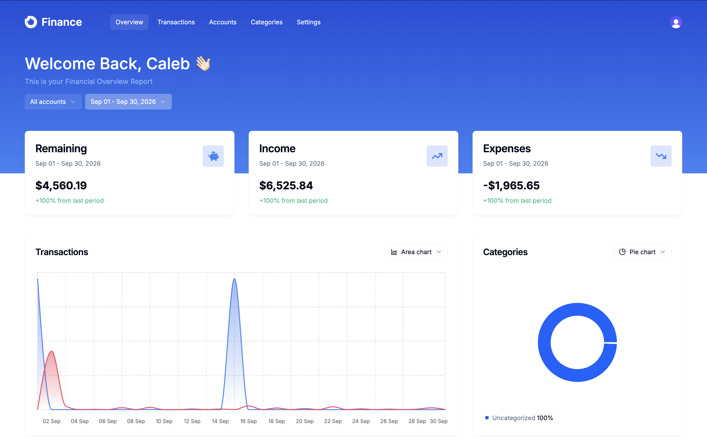
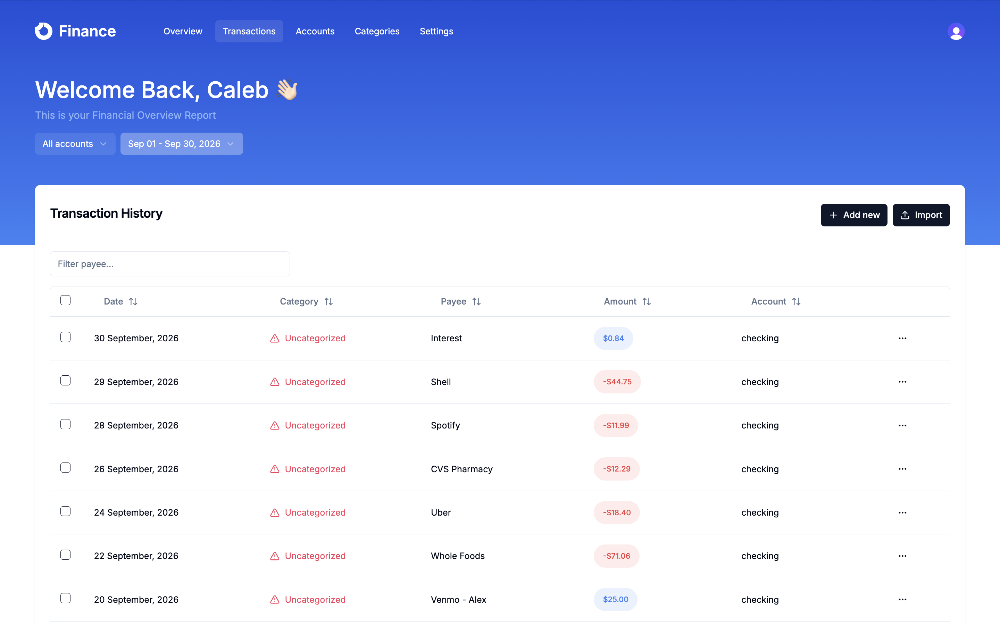
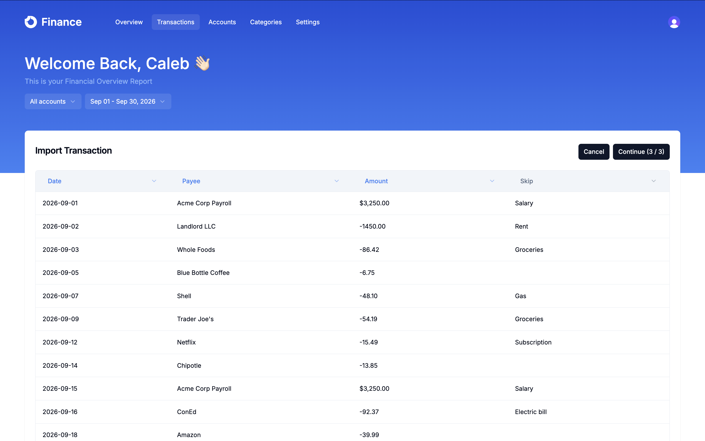
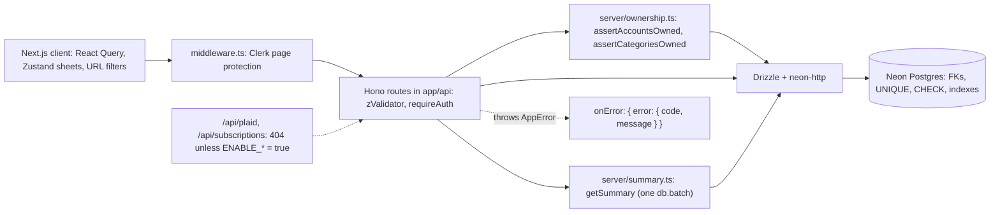

# Personal Finance Platform

A multi-tenant personal finance app: track accounts, categories, and transactions, import bank CSVs, and see income, expenses, and spending by category over any date range.

It started from a Next.js tutorial. I then rebuilt the backend to be correct and defensible: integer-cents money, a `DATE` business-date model, tenant-safe authorization, strict CSV parsing, a consistent error contract, isolated Neon environments with transactional migrations, integration tests against real Postgres, and one measured query optimization (dashboard p50 **324 ms → 47 ms** over 500k rows).

**Live demo:** https://finance-saas-caleb.vercel.app/. Sign up with any email. Try the import with [`docs/sample-transactions.csv`](docs/sample-transactions.csv).





## Features

- **Auth:** Clerk sign-up and sign-in. Every dashboard page and API route requires a session.
- **Accounts and categories:** create, edit, delete, bulk delete.
- **Transactions:** create, edit, delete, bulk delete. Filter by date range and account (URL state), search by payee.
- **CSV import:** map columns, pick an account, import. Money and dates are parsed strictly, errors name the exact row, and a file with one bad row imports nothing.
- **Dashboard:** income, expenses, and net for the selected range, the change from the previous period of the same length, a category breakdown (including "Uncategorized"), and a daily income/expense chart.

## Tech stack

Next.js 14 (App Router) · React 18 · TypeScript · Hono (API routes and RPC client) · Drizzle ORM · Neon Postgres (`neon-http`) · Clerk · TanStack Query · Zustand · Zod · Tailwind and shadcn/ui · Recharts · Vitest · Bun · Vercel

## Architecture



**One request:** a React Query hook calls the typed Hono client. The router runs `clerkMiddleware()` and `requireAuth` (401, fails closed), then `zValidator` (400). Write handlers check that every referenced account and category belongs to the caller (422), and all queries are scoped by `accounts.user_id`. Handlers return `{ data }`. Any thrown `AppError` becomes `{ error: { code, message } }`, which the mutation hooks show as a toast.

**What enforces what:**
- **Postgres:** foreign keys with `CASCADE` / `SET NULL`, `UNIQUE` constraints, and `CHECK` constraints on name and payee lengths and on Plaid link consistency.
- **The application:** tenant ownership. Transactions are owned *through* their account (no denormalized `user_id`), so the database can't express it.

| Path | Purpose |
|---|---|
| `app/api/[[...route]]/` | Hono routers: accounts, categories, transactions, summary (plus the feature-flagged plaid and subscriptions routers) |
| `server/http/` | `AppError`, `onError`, `requireAuth`, the `zValidator` hook |
| `server/ownership.ts` | Set-based ownership checks for write paths |
| `server/summary.ts` | Dashboard queries, shared by the route, the correctness test, and the benchmark |
| `server/feature-flags.ts` | Fail-closed `ENABLE_PLAID` / `ENABLE_SUBSCRIPTIONS` |
| `lib/money.ts`, `lib/dates.ts`, `lib/csv-import.ts`, `lib/schemas/` | Money and date parsing, CSV normalization, API DTOs |
| `db/schema.ts`, `drizzle/` | Schema and migrations (`0003`–`0006` are V2) |
| `scripts/` | Guarded migrator, per-user seed, benchmark seed and runner |
| `tests/unit`, `tests/db` | Unit tests, and integration tests against a Neon test branch |

## Engineering highlights

**1. Money as integer cents.** V1 stored integer "miliunits" (1/1000 of a dollar, capped at about $2.1M per row), converted them with `parseFloat` and multiplication in several places on the client, and parsed CSV amounts the same way. V2 stores `amount_cents INTEGER` (positive = inflow). [`parseMoneyToCents`](lib/money.ts) parses strings with a regex and integer math, never `parseFloat`, so `1.15` can't turn into `114.99999999999999`. It rejects ambiguous input (`12,34`, `1.005`) instead of guessing. There's one input boundary and one display boundary. `SUM` over `integer` returns `bigint`, so totals can't overflow.

**2. Business dates as `DATE`.** A transaction date is a calendar fact, not an instant. V1 stored date-picker entries at local midnight converted to UTC, but CSV rows at UTC midnight, so the same day could land on different dates. V2 uses a Postgres `DATE` and `"YYYY-MM-DD"` strings end to end, parses and formats from local components, and does range arithmetic in UTC epoch days so DST can't drop a day. A DB contract test round-trips dates under `TZ=Pacific/Kiritimati` (UTC+14).

**3. Multi-tenant authorization.** V1 had an IDOR: transaction create, update, and bulk-create trusted `accountId` and `categoryId` from the request body, so a signed-in user could write into, or move rows into, another tenant's account. V2 adds [`assertAccountsOwned` / `assertCategoriesOwned`](server/ownership.ts). Each is a single set-based query, so a 5,000-row import costs two ownership queries, not 10,000. A path ID you don't own returns 404. A body ID you don't own returns 422 with the same message as a nonexistent one, so the API doesn't leak which IDs exist. Integration tests drive the real routers with two users.

**4. Measured query performance.** On a deterministic 501k-row benchmark branch, every dashboard query was a `Parallel Seq Scan`: for a 30-day range Postgres read about 121 rows for every row it used, four times per request. I added one composite index, `transactions(account_id, transaction_date)`, then sent the four queries in one `db.batch()` round trip, re-measuring after each change. Results were identical before and after (SHA-256 of the output).

| `getSummary`, heavy tenant (150k rows) | Baseline | Final | Change |
|---|---|---|---|
| Postgres execution, 30-day range | 198.71 ms | 11.28 ms | −94.3% |
| Postgres execution, 365-day range | 362.11 ms | 125.37 ms | −65.4% |
| End-to-end p50, 30-day range | 323.71 ms | 46.92 ms | −85.5% |
| End-to-end p50, 365-day range | 306.58 ms | 136.88 ms | −55.4% |

Method, plans, and the alternatives I rejected: [`docs/benchmarks.md`](docs/benchmarks.md).

**Also:** every failed mutation shows the server's message, and a 4xx never shows a success toast. Validation errors use the same envelope as every other error. `onError` never echoes unexpected errors. All dashboard pages are protected (the tutorial's middleware matcher was mis-escaped). The `connected-bank` endpoint no longer returns the Plaid access token. The dashboard's category breakdown now includes uncategorized spending.

## Tutorial baseline vs. my V2 work

The baseline is [code-with-antonio/nextjs-finance-saas](https://github.com/code-with-antonio/nextjs-finance-saas) (commits `01`–`28` in this repo's history). My work is in the four commits after it.

| From the tutorial | Mine (V2) |
|---|---|
| UI, layout, and shadcn components | Schema redesign (`0003`–`0006`): FKs, `CHECK` and `UNIQUE` constraints, indexes |
| CRUD screens, sheets, and data tables | Integer-cents money model and parser |
| Charts and the dashboard layout | `DATE` business dates and the date utilities |
| Hono + Drizzle + Clerk + Neon setup | Request and response DTOs, so clients no longer import the DB schema |
| CSV upload and column-mapping UI | Strict CSV parsing with row-numbered, all-or-nothing errors |
| Plaid Link and LemonSqueezy flows (now disabled) | Tenant authorization (closed the IDOR) and the `connected-bank` token leak fix |
| | Error envelope, `requireAuth`, and mutation error handling in the UI |
| | Page protection fix and the "Uncategorized" breakdown fix |
| | Isolated dev/test/bench Neon branches, transactional guarded migrator, guarded per-user seed |
| | Vitest unit and DB integration tests |
| | The benchmark harness, the index, and the batched summary |
| | Fail-closed feature flags for the unfinished Plaid and subscription integrations |

## Local setup

Requires [Bun](https://bun.sh), a [Clerk](https://clerk.com) application, and a [Neon](https://neon.tech) project with three branches: `dev`, `test`, and `bench`.

```bash
bun install
cp .env.example .env.local   # then fill it in (see below)
bun run db:migrate           # dev branch
bun run db:migrate:test      # test branch (needed for test:db)
bun run dev
```

`.env.local`:
- **Clerk:** `NEXT_PUBLIC_CLERK_PUBLISHABLE_KEY`, `CLERK_PUBLISHABLE_KEY`, `CLERK_SECRET_KEY`, `NEXT_PUBLIC_CLERK_SIGN_IN_URL=/sign-in`, `NEXT_PUBLIC_CLERK_SIGN_UP_URL=/sign-up`.
- **Database:** `DATABASE_URL`, `DATABASE_URL_TEST`, `DATABASE_URL_BENCH`. Use the *direct* (non-`-pooler`) connection strings. The migrator rejects pooled URLs and refuses to run if two targets point at the same database.
- **App:** `NEXT_PUBLIC_APP_URL=http://localhost:3000`.
- **Optional:** `SEED_USER_ID`, your Clerk user ID, for `bun run db:seed`. The seed replaces only that user's manually created rows.
- **Leave unset:** `ENABLE_PLAID`, `ENABLE_SUBSCRIPTIONS`, and the Plaid and LemonSqueezy keys.

| Command | What it does |
|---|---|
| `bun run test` | Unit tests |
| `bun run test:db` | Unit plus integration tests against `DATABASE_URL_TEST` (truncates that branch only) |
| `bun run typecheck` / `bun run lint` / `bun run build` | Static checks and production build |
| `bun run db:seed` | Sample data for `SEED_USER_ID` on the dev branch |
| `bun run db:migrate:bench`, `bench:seed`, `bench:summary <label>` | Reproduce the benchmark (see `docs/benchmarks.md`) |

Use `bun run test`, not `bun test`, which is Bun's own test runner.

## Deployment

Deployed on Vercel against the Neon `prod` branch (the test and bench branches are never deployed). Migrations are applied manually with `bun run db:migrate` before deploying. Plaid and subscriptions stay off because `ENABLE_PLAID` and `ENABLE_SUBSCRIPTIONS` are unset, so their routes return 404.

## Limitations and future work

- **Plaid bank sync:** cursor-based `/transactions/sync` (`added` / `modified` / `removed`), webhooks, sync concurrency, token encryption at rest, and `itemRemove` on disconnect. The tutorial's one-shot import is behind a disabled flag.
- **Not built:** budgets, recurring-payment detection, multi-currency (the app is USD only), and server-side pagination of the transaction list.
- The default date range (when the URL has none) uses the server's "today". The dashboard's category breakdown groups by name.
- CSV amounts use positive = inflow. Exports with the opposite sign convention need flipping first.
- No rate limiting, audit log, or error tracking.
